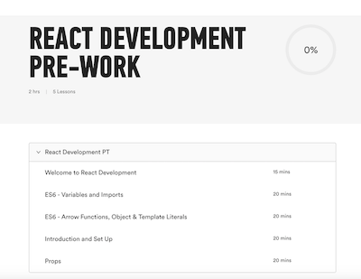

# Pre-Work Review

---

<aside class="notes">

**Teaching Tips**:

- This is a student view of the table of contents for the pre-work on myGA.

- Students should have completed all work prior to the start of the course.

- Review each lesson. How much time you spend on each lesson will vary. Always get a barometer reading of the class. If students seem comfortable with the material of a given lesson, call out a few specific key points and move on. If however, students seem confused/concerned about the content of a given lesson, do a deeper review. Maybe go through the lesson slide-by-slide. 

- Links to a sandbox version of each lesson are in this document, so you can easily project the lessons and walk through them. Please do not share out these links.

- As you review, be sure to elicit questions. Always ask "What questions do you have?" (open ended). Never ask "Does anyone have any questions?" (close ended). The former phrasing is more welcoming and encourages students with questions to speak up.

- If the class is split (one or more students need a deeper review of a given lesson whereas the rest feel comfortable with that material), recruit the more advanced students to help you with the ones needing the deeper review. You can partner up a student who understands the material with one that is struggling. As an alternative, you may move on, but ask the struggling students to see you in office hours. Or direct them to additional tutorials.

- Be sure to spend sufficient time on the blog post exercise in the props lesson. Students must all have their blog code in good order before moving on — that is a dependency for the next lesson. 

</aside>

---

## Pre-Work Lesson: Welcome to React Development

### Learning Objectives:

By the end of this lesson, you'll be able to:

- Describe the course flow.
- Describe why you have pre-work.
- Install Slack.

<aside class="notes">

**Teaching Tips**:

- [Sandbox version of lesson](https://my.generalassemb.ly/activities/838?from=assignment "Welcome to React Development") - remember to open this is a new tab.

- Be sure everyone has Slack installed and is on the class channel.

- Ask: "What questions do you have?"

</aside>

---

## Pre-Work Lesson: ES6-Variables and Imports

### Learning Objectives:

By the end of this lesson, you'll be able to:

- Understand what ES6 is.
- Discuss some of the key language features of ES6.
- Describe why ES6 is integral to React programming.
- Distinguish between JSX and ES6.

<aside class="notes">

**Teaching Tips**:

- [Sandbox version of lesson](https://my.generalassemb.ly/activities/477?from=assignment "ES6 - Variables and Imports") - remember to open this is a new tab.

- Elicit from students what purpose `const` and `let` serve.

- Consider reviewing the [CodePen activity](https://codepen.io/SuperTernary/pen/owQGmy?editors=001) with them.

- Remind students that with ES6 you can import modules directly without declaring them as global variables.

- Ask: "What questions do you have?"

</aside>

---

## Pre-Work Lesson: ES6-Arrow Functions, Objects & Template Literals

### Learning Objectives:

By the end of this lesson, you'll be able to:

- Effectively use arrow functions.
- Effectively use object literal shorthand.
- Effectively use template literals.

<aside class="notes">

**Teaching Tips**:

- [Sandbox version of lesson](https://my.generalassemb.ly/activities/478?from=assignment "ES6-Arrow Functions, Objects & Template Literals") - remember to open this is a new tab.

- Remind students about this: One "gotcha" to be aware of with implicit returns is that object literals must be wrapped in parentheses. Example: `const isItActive = isActive => ({ active: isActive });`

- Consider reviewing the [Codepen activity](https://codepen.io/SuperTernary/pen/eRQeOR?editors=001) that reviews combining an arrow function with a template literal.

- And [this other CodePen activity](https://codepen.io/susir/pen/yMWvWm?editors=001) that asks students to modify the code to ES6 syntax. You can review [the solution](https://codepen.io/susir/pen/OpYvqK?editors=001) here.

- Ask: "What questions do you have?"

</aside>

---

## Pre-Work Lesson: Introduction and Set Up

### Learning Objectives:

By the end of this lesson, you'll be able to:

- Describe what React is and how it us used.
- Set up a basic React app.
- Identify React components.
- Write out React components in JSX, a syntax extention to JavaScript.
- Understand how the virtual DOM acts as a staging area for changes in React.

<aside class="notes">

**Teaching Tips**:

- [Sandbox version of lesson](https://my.generalassemb.ly/activities/472?from=assignment "Introduction and Set Up") - remember to open this is a new tab.

- Start by asking why React is such a big deal. Where is it used? Elicit specific functionality on specific websites.

- Double check that everyone has node and npm installed. If not, send them here: https://www.npmjs.com/get-npm

**Talking Points**:

- What questions do you have about initiating a react application?

- What is a component? (Consider queueing up the Craigslist slide here - it's at 33% on the progress bar.)

- What is JSX? What function does it serve?

- What is the virtual DOM? How does it differ from the DOM? How is it used in React?

</aside>

---

## Pre-Work Lesson: Props

### Learning Objectives:

By the end of this lesson, you'll be able to:

- Define React props.
- Add props to a component.
- Pass multiple props to a component.
- Create objects as props.
- Create a React component from scratch.

<aside class="notes">

**Teaching Tips**:

- [Sandbox version of lesson](https://my.generalassemb.ly/activities/473?from=assignment "Props") - remember to open this is a new tab.

- Check for understanding of the learning objectives. Call on random students and ask comprehension questions like, "A component class will just ignore any props it receives that it doesn't use — true or false? Explain your answer." If student doesn't know, allow others to try and answer.

- Show and Tell: Show me your blog post (81% on progress bar). Go around the room and see how students did with this exercise. Ask, "What was tough about this?" (not, "Was this tough?"). Address any difficulties the students had.

</aside>

---

<aside class="notes">

**Teaching Tips**:

- Be sure all students seem ready and eager to move on, before you wrap up the pre-work review. Consider prompting them as follows: "The pre-work was loaded with information. What further questions do you have? What can I clarify? There are no silly questions. Chances are the guy or gal sitting next to you has the same question, so fire away!"

</aside>
