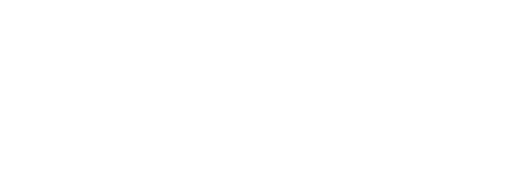

##  {.separator}

<h1>Welcome to React Development</h1>

<aside class="notes">

* Overview
This lesson serves as the kick-off for your React Development course. Whether you’re delivering this course online or in person, in a 1-week, accelerated or 10-week, part-time format, take the first hour or so of your time together to start things off on the right foot.

This lesson is designed to introduce yourself and GA and get the students comfortable and excited to learn. After that, there's a brief review of the pre-work.

* Learning Objectives
In this lesson, students will:
- Define class expectations and norms.
- Understand key concepts introduced in the pre-work.

* Duration
60 minutes

* Before Class: Preparation
- Take some time to consider your expectations for learners, and be prepared to talk about them.
- Choose an "ice breaker" to run that will allow learners to get to know one another in a fun, informal, low-stakes way. We have a list of activities [here](https://docs.google.com/presentation/d/1a91IqhzijI_3EqU-trJbZN4vDDSU0rXqgIrqGwsWM7I/edit) for you to choose from (as well as other good slides to copy). If you have some good ones, feel free to share your ideas with us!
- Before class, review completion data to understand how far your learners have progressed through the myGA pre-work.
-- If most of your learners have completed the pre-work, you should be able to breeze through this lesson very quickly.
-- If most of your learners have not completed all of the pre-work, you might want to spend more time on this lesson and reduce your timings for the rest of the lessons in Unit 1.

</aside>

---

## Agenda

*Here's what we'll cover:*

- Instructional team and classmate introductions.
- About General Assembly.
- Course and classroom structure.
- The final project.

<aside class="notes">

**Talking Points**:

- Welcome!

</aside>

---

## Meet Your Instructor

**{Insert your name}**

- {Insert your email address.}
- {Insert key facts about yourself and your career.}
- {Insert your current role.}
- {Insert cool companies/brands you’ve worked with.}
- {Insert one fun fact about you.}

<aside class="notes">

**Talking Points**:

- Talk about the instructor’s role as the instructional team “lead.”

</aside>

---

## Meet Your Support Team

**{Insert IA's name}**

- {Insert IA's email address.}
- {Insert key facts about IA and IA's career.}
- {Insert cool companies/brands IA hopes to work with.}
- {Insert one fun fact about IA.}

<aside class="notes">

**Teaching Tips**

- Duplicate this slide for each IA or classroom member you want to introduce.

</aside>

---

## Front Lines

Have a question about:

- The campus?
- Lost and found?
- Loaner equipment?
- Free coffee and snacks?

Come here to talk to Front Lines and they will help you out.

{Picture of the local Front Lines desk.}

<aside class="notes">

**Teaching Tips**:

- Introduce anyone here; see the next slide for a template.

</aside>

---

## More Great People

{Bulleted list of names and roles}

<aside class="notes">

**Teaching Tips**:

- These are common faces on campus that students should know about.

</aside>

---

## More Great People: You! Meet Your Classmates

Please share:

- Your name.
- Why you’re taking this course and what you want to get out of it. Anything specific you want to build or learn?
- What's your development background?
- What’s your favorite place you’ve ever visited?

<aside class="notes">

**Teaching Tips**:

- The following is an ice breaker activity; you could do that instead of (or in addition to) these questions.

</aside>

---

## What Is General Assembly?

- More than 20 global campuses across 6 countries.
- A thriving alumni community of 50,000+ full- and part-time graduates.
- Corporate training with 350+ companies, including more than 40 of the Fortune 100.
- 500,000+ attendees at bootcamps, workshops, and events.

<aside class="notes">

**Teaching Tips**:

- Go through this section quickly. Students have probably heard this information before in info sessions or via the GA website.

</aside>

---

## What Is General Assembly's Mission?

<h3>"GA was founded on the principle of empowering people to pursue the work they love. Since we opened our first campus in 2011, we have had the privilege of working with students, governments, and the world’s largest companies to create opportunities to radically transform careers and economic prospects."</h3>

 — Jake Schwartz, Founder + CEO, General Assembly

<aside class="notes">

**Teaching Tips**:

- Rather than reading the quotation out loud, take this opportunity to share with students your own reasons for being part of GA’s mission.

</aside>

---

## Moving On to Course Specifics...

OK, we know that GA is cool!

And your classmates are cool.

Now, let's talk about the course.

<aside class="notes">

**Teaching Tips**:

- Transition from talking about GA in general back to talking about the React course.

</aside>

---

## Classroom Culture

*Remote Classroom Culture and Norms*

_Think about the last time you were in a classroom environment_ - remember the classroom rules that were on the wall? Some rules that you were told to follow may have been, “Do not talk until called on.” “Raise your hand if you have a question.” “Respect everyone.”

Instead of making rules for the classroom environment, *we have norms that we expect everyone to respect and adhere to*. We call them norms as we have identified these practices as most effective for ensuring that learning happens in our remote classrooms, and they emphasize the collaborative nature of our courses.

<aside class="notes">

**Talking Points**:

- Stereotypical classroom vs remote
- Norms

</aside>

---
## Classroom Culture

Four Key Norms for a Successful Remote Class

_Environment_ - Consider where you learn best

Think about how you learn best:
*  Do you like noise or silence?
*  Does movement distract you, or does it help you focus on the task at hand?

Learning takes attention, and be sure that *your full attention is focused on your class when you are there.*

_Video Practices_ - How you can most effectively participate in class.

*  *Always keeping your video on and your microphone muted is a great way to feel present in a group* without disrupting the experience for your peers.
*  If you would like to chime in or ask a question, you can (and should!) come off mute!
*  If you need to step away from your computer for a few minutes, or you are eating a delicious bowl of salad, direct message your instructor and turn your video off. Don’t forget to come back!

<aside class="notes">

**Talking Points**:

Environment: The great thing about learning remotely is that you can be where you are most comfortable… but that can also be the worst thing. Your family knocks at the door to get your attention, your doorbell rings, your dog wants to go for a walk… you get the idea.

Video Practices: Remember - these videos are recorded and posted!

</aside>

---

## Classroom Culture

*Four Key Norms for a Successful Remote Class*

_Professionalism_ - Maintain a professional demeanor

_Think about the last time you were in a classroom environment - how did you interact with your peers?_

Learning in your own space is very comfortable, and at times, it is easy to forget that you are on camera and in class!

*The same classroom norms apply:* speak to each other respectfully, avoiding profanity. Be sure your attire is appropriate for a classroom setting, and the location you are in does not have any images or paraphernalia that others may find disrespectful.

_Community_ - Participate! We learn through doing!

*Participate!*

Come off mute to ask questions, actively engage in the breakout rooms - we learn through doing!

This is what sets our remote classroom apart from similar institutions  - *it is an interactive experience.*

<aside class="notes">

**Talking Points**:

</aside>

---

## Classroom Culture

Building Community through Breakout Rooms - Yeah, we're not that big of a class!

- Typically we would be using breakout rooms. Since this is such a small class, we're going to all work together in one small group!
- At GA, we use collaborative work to create a community of learners in our remote environment. Unlike group work, which has a “divide and conquer” mentality and less direct interaction, focusing solely on the end goal, collaborative work requires learners to work together directly, and focuses both on the process and the end goal.

<aside class="notes">

**Teaching Tip**:

- This may or may not be relevant for your class. Remove if unnecessary.

</aside>

---

## Classroom Culture

- Plagiarism (passing someone else's work off as your own) will only result in you getting job that you're unqualified for and from which you will get fired.
	- How do I know?
		- What is it?
			- Copying another student's code
			- Copying another student's code and altering it to look like yours
			- Copying a solution to a homework question, lab, or project that you found online
			- Copying a solution to a homework question, lab, or project that you found online and altering it to look like yours
		- What is it not?
			- Finding syntax online that will help you build the solution that you came up with
			- Asking another student to debug your code or help you work with your own solution.  Note, this is not "what did you get for question 1?"
		- How to stay safe
			- Come up with your own idea about how to solve the problem and find syntax online to help you create it
			- Do not try to find the answer to how to solve the problem online or get it from another student
			- If you use a chunk of code that is more than a few lines long, even if you alter it, cite it with a comment in your code.  Give either a link to the site or the student that gave it to you.  If what you're citing is the majority of your solution, it's probably plagiarized.
	- Your employers will quickly discover that you don't know what you say you know
	- If you feel you can't complete the work, come to your instructors and we can figure out a way for you to turn in something meaningful.  There is always a solution.
	- You can usually receive a partial refund or continue in another course if withdrawing for family/external issues.  Not for plagiarism.  Come to us before doing anything extreme.
	- Even if you succeed in making us believe you are responsible for plagiarized work, ultimately, when you graduate, you will have only a meaningless certificate and none of the knowledge to back it up

  **What It Is Not**
  - researching algorithms or approaches to similar problems

  <aside class="notes">

  **Talking Points**:

  </aside>

---

## How to Get a Certificate of Completion

1. Attend all classes on time.
2. Meet expectations on all projects on time.
3. Complete your final project.

<aside class="notes">

**Teaching Tips**:

- This slide details how to get a certificate of completion. If anything is different, change it!

</aside>

---

## Course Materials

- Slack
- Zoom
- NPM/Node
- Git/Github
- Create React App

<aside class="notes">

**Teaching Tips**:

- Ask students if they have all tools installed or had any trouble accessing them.
- Fist of 5 on how familiar students are with all the above.

</aside>

---

## Homework

- Homework isn't graded by a score, or even by pass or fail. It's based on completion.
- An hour before class all homework should be submitted via Github

---

## Your Final Project

- Each day, you’ll build skills in React and understand different ways in which you can use it to build applications.

This is an open-ended project. We can't provide any set solution, but we're always here to help.

You'll be making your own website. This can be a website you imagine, but feel free to pick an existing website and try to mimic it. Some sites that use React that you can model yours after are:

  - https://www.airbnb.com/
  - https://citymapper.com/boston
  - https://reddit.com
  - https://www.instagram.com/
  - https://www.nytimes.com/

Once you have a website with basic functionality that you're satisfied with, look at the "Further Directions" section and choose at least one of the options to implement.

<aside class="notes">

**Teaching Tips**:

- Explain details of the final project
- Encourage students to be thinking throughout the course about what they want to build.
</aside>

---

## Before We Begin

Let's discuss...

- If you have to miss class
- Zoom
- Slack
  - Attendance thread
  - 1:1
  - Emoji Responses
- Course Materials
- Project Submissions

<aside class="notes">

**Teaching Tips**:

</aside>

---

## Q&A and Summary

What other questions do you have?

<aside class="notes">

**Talking Points**:

- Check to see if there are any lingering questions on the course or GA.
- Mention that, next up, we'll review the pre-work.

</aside>

---
