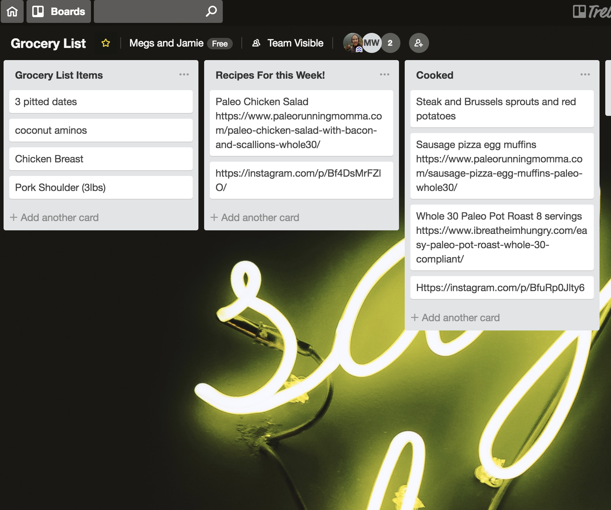
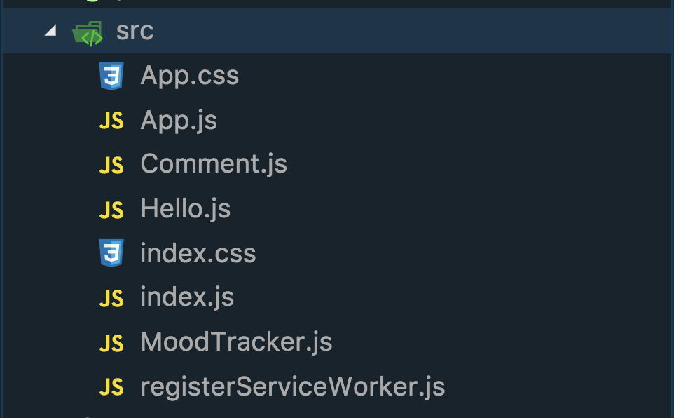
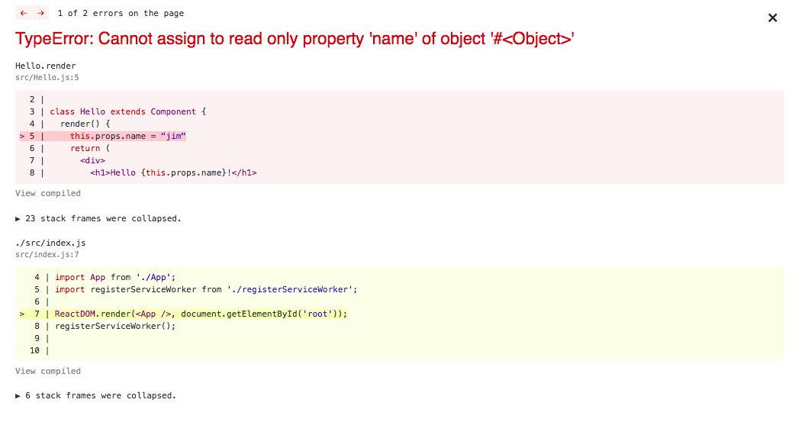

#  React State

## Learning Objectives

_By the end of this lesson, you will be able to:_

- Define what "state" means in relation to React components
- Differentiate between this.state and this.props
- Create an initial state in a component
- Change the state of a component

<aside class="notes">

**Teaching Tips**:

Notes to cover in Homework Review

- Make sure students are using proper naming conventions when building `FilmListing` and `FilmDetails` components.
- Make sure each component is in it's own file.
- Review the `import` keyword and importing the film details.
- Make sure students properly used the getFullYear() method for the `release_date`

</aside>


--- 

## Trello





<aside class="notes">

**Talking Points**:

- Imagine that you are a user of [Trello](https://www.wunderlist.com), a popular project management app.

- This app is great for managing and keeping track of grocery lists, chores, and personal projects!  As we see above, this can be used to add and remove information dynamically all within the browser. How have we handled dynamic data so far in React? How could we manage to change this data?

</aside>

---

## Intro

 `hello_world` project status check.


<aside class="notes">

**Talking Points**:

- Before getting started, let's make sure that our `hello_world` project is up and running.

- Be sure to switch which app is running locally!

- In React, we are able to handle data in one of two ways...

- `props` **represent** data that is **immutatable** or read-only. Let's see what happens when you try and directly change `this.props.name` in the `Hello` component.

- But what about when we need data that is dynamic and changes? That's where React's `state` comes in!

</aside>

---

### What's state?


<aside class="notes">

**Talking Points**:

- Values stored in a component's `state` are **mutable** or changable attributes.

- `state` may appear similar to `props`, but there are quite a few important differences

- Like props, which we access through the `this.props` object, we can access state using `this.state`

- Since `state` has the ability to be changed, it is not quite as straightforward as props. However, once you get the hang of it... You'll be able to build really interactive apps!

---


Create a new file called `src/MoodTracker.js`.

`$ touch src/MoodTracker.js`



<aside class="notes">

**Talking Points**:

- Let's modify our earlier Hello World application to include a new `MoodTracker` component. In our `MoodTracker` there will be a mood displayed, and eventually a user will click a button to indicate on a scale of 1-10 how much of that mood they are feeling.

- In order to get started with our new `MoodTracker` component, lets first create a new file called `src/MoodTracker.js`.

- `$ touch src/MoodTracker.js`

- Your directory structure should now look something like what is seen here.

</aside>

---

```jsx
// ...
import MoodTracker from "./MoodTracker";

class App extends Component {
  render() {
    // ...
    return (
      <div className="App">
        ...
        <MoodTracker />
      </div>
    );
  }
}

export default App;
```

<aside class="notes">

**Talking Point**:

- After creating the file, let's make sure to import our new component into `App.js` and put the component in our `render` method.


**Teaching Tips**:

- In this intro, make sure to mention that the concept of state is not React specific.  Any values that are stored and manipulated on the front end can be considered the state of the application.

- It's worth spending extra time reiterating that props are **immutable** and can not be changed

- Use the existing react repo to show what happens if you directly manipulate props. Make sure that the student's do not codealong and instead are focused on seeing what happens on the instructors machine. Your error message should looks something like this.



</aside>

---

### Initial State

`constructor`

<aside class="notes">

**Talking Point**:

- When working with values that are dynamic and changing, it's a good idea to provide an initial value for the changing pieces of data. Just like classes in other programming languages, a good way to make initial values is by creating a `constructor`. Constructors say, "When you create an instance of a class, do this." Without a constructor explicitly defined by us, our components will use the default constructor inherited from the `Component` class. That's why we didn't need a constructor before - we weren't doing anything differently than the normal default for every component.

</aside>

---


```js
class MoodTracker extends Component {
  // what should happen when the component is first created
  constructor() {
    // make call to parent class' (Component) constructor
    super();
    this.state = {
      // Your info here
    };
  }

  // what should the component render
  render() {
    //  ....
  }
}
```

<aside class="notes">

**Talking Point**:

- The first thing we always put in a constructor is a call to `super()`, which says "You should still do the default initialization for this class."

- Finally, we will add `this.state = {}`. This is setting the initial values for our data that is changeable.

</aside>

---

#### React Components in 2018


```js
class MoodTracker extends Component {
  // what should the state be when the component is created
  state = {
    // Your info here
  };

  // what should the component render
  render() {
    //  ....
  }
}
```

<aside class="notes">

**Talking Point**:

- Even though you may see the `constructor` syntax used in some online resources, the best practices for how to write the initial state for components has changed in recent years. Instead, we can create a component and directly define the starting state without ever having to use the constructor.

- Much cleaner, right? Through the course we are going to use this newer way to define state, but you may run into the `constructor` syntax when doing your own research.

</aside>

---

```js
class MoodTracker extends Component {
  // define an initial state
  state = {
    moodPoints: 1 // initialize this.state.moodPoints to be 1
  };

  // what should the component render
  render() {
    //  ....
  }
}
```

<aside class="notes">

**Talking Point**:

- Now that we have the skeleton for our component built, let's define the initial values of our `state`. We can do this by giving a value to the `state` object. Inside of that object, we can define any variables we'd like.

- We'll start our state with just one key-value pair inside. The key or label will be `moodPoints`, and the initial value for the `moodPoints` key will be 1.

- At the top of the `MoodTracker` class in your `src/MoodTracker.js` file, add the `constructor` function.

</aside>

---


```html
<p>You are this happy: {this.state.moodPoints}</p>
```


```js
return (
  <div>
    <p>On a scale of 1-10</p>
    <p>You are this happy: {this.state.moodPoints}</p>
  </div>
)
```

> Check it out! If you browse to http://localhost:3000, your state will be displayed.

<aside class="notes">

**Talking Points**:

- Next, let's make sure we display that information to the user. In your `render` method, we'll let the user know how many mood points they are at by adding in the line seen here.

- Note how similar this looks to using props. All React Components include both this.props and this.state

- All together, the code inside `render` for our `App.js` can now look as seen here.

**Teaching Tips**:

- Don't spend much time on the constructor syntax.  It may help those who are familiar with other OOP patterns, but it is not commonly used now.
- As you code along, make sure students `import` and `export` properly.  Move the new component to a `components` directory if it help with your organization.
- Now that you have a value in your `state` object, this can be a good opportunity to show how React Dev Tools can update `state` to help with debugging.

</aside>

---

### Changing State


#### CFU: Events in JS


<aside class="notes">

**Talking Point**:

- Now that we have some initial value up on the page, let's learn how to change this value and make it more dynamic.

- Step one in this process is to trigger an **event**. When the user interacts with the page in any way.

- Think back to using regular JavaScript or jQuery. What is the purpose of an event listener? Can you show me how to create a click event in JavaScript?

**Teaching Tips**:

- If students do not have much experience with `events`, make sure to talk through the event keyword.  A good way to explore the event key word is to explore the object when adding this event listener to the DOM

```js
  document.body.addEventListener('keypress', (e) => console.log(e))
```

- After running that code, type a letter into the DOM and you should see the event object.  Explore through this with the class so that they can see things like `e.target.value` and `e.key`

</aside>

---

### Events in React

Event listeners in React look very similar to adding events through HTML attributes. There are 2 main differences when working with React's synthetic events:

1. 
   - `onClick` (React) vs `onclick` (HTML)
   - `onSubmit` (React) vs `onsubmit` (HTML)
   
2. 
   - `<button onClick={this.doSomething}>Click Me</button>`(React)
   - `<button onclick="doSomething()">Click Me</button>` (HTML)

Additionally, there are TONS of events available to React elements.


<aside class="notes">

**Talking Points**:

- Event listeners in React look very similar to adding events through HTML attributes. There are 2 main differences when working with React's synthetic events:

- 1. React events are named using camel case instead of lowercase.
   - `onClick` (React) vs `onclick` (HTML)
   - `onSubmit` (React) vs `onsubmit` (HTML)
- 2. In JSX, you pass the actual function in as the handler, rather than a string.
   - `<button onClick={this.doSomething}>Click Me</button>`(React)
   - `<button onclick="doSomething()">Click Me</button>` (HTML)

</aside>

---

#### Turn and Talk: Synthetic Events

Check out the React Docs on supported events: https://reactjs.org/docs/events.html#supported-events

With a partner, discuss the following:

1. What events could you see yourself using often?
2. What sort of events sound niche, but interesting to play around with?

<aside class="notes">

**Teaching Tips**:

- Make sure to highlight the following commonly used events.
  - onClick
  - onChange
  - onSubmit
  - onKeyPress
  - onMouseOver

</aside>

---

#### Codealong Continued: Setting State

We will create a button that the user can click, which will increase their mood by one.

> CFU: If we were just working with regular old JavaScript, what could we use to increase the number of a variable by one?

> How would we add or remove and item from an Array?

> How about changing the value of a key-value pair an object?


<aside class="notes">

**Teaching Tips**:

- If the class is advanced, this can be a good opportunity to introduce the [spread](https://developer.mozilla.org/en-US/docs/Web/JavaScript/Reference/Operators/Spread_syntax) operator.
 
</aside>

---


```js
increaseMood = () => {
  this.setState({
    moodPoints: this.state.moodPoints + 1
  });
};
```

<aside class="notes">

**Talking Points**:

- Unfortunately, changing the value of `this.state` isn't quite as straightforward as something like `this.state.moodPoints++`.

- Instead, when we want to update a value in React, we will do so by using a method called `this.setState()`.  This method helps React update only certain parts of the DOM, resulting in a much faster website!

- First, we will create a method to increase the mood. Under the `Hello` constructor, above the `render` method, add the method seen here.

- ES6 Update: We are going to be using arrow functions often in React.  Check out the [Mozilla Developer Network](https://developer.mozilla.org/en-US/docs/Web/JavaScript/Reference/Functions/Arrow_functions) for more info.

- Note that we call `this.setState` to change the state.

</aside>

---

```js
  render () {
    // Remember: can only return one top-level element

    return (
      <div>
        <p>You are this happy: {this.state.moodPoints}</p>
        <button onClick={this.increaseMood}>Cheer up!</button>
      </div>
    )
  }
}
```


<aside class="notes">

**Talking Points**:

- Now we'll create the button to trigger calling this function. The button will be displayed to the user, so we'll add it to the `render` function. When the user clicks it, we'll call the `increaseMood` function.

- Why did we write `onClick={this.increaseMood}` vs `onClick={this.increaseMood()}`?

- More Info: [Function Call vs Function Reference](https://stackoverflow.com/questions/15886272/what-is-the-difference-between-a-function-call-and-function-reference)

</aside>

---

Altogether, your `App.js` file now looks like this:

```js
// bring in React and Component from React

import React, { Component } from "react";

// define our MoodTracker component
class MoodTracker extends Component {
  state = {
    moodPoints: 1 // initialize this.state.moodPoints to be 0
  };

  // increase moodPoints by 1 in this.state
  increaseMood = () => {
    this.setState({
      moodPoints: this.state.moodPoints + 1
    });
  };

  // what should the component render
  render() {
    // make sure to return some UI

    return (
      <div>
        <p>You are this happy: {this.state.moodPoints}</p>
        <button onClick={this.increaseMood}>Cheer up!</button>
      </div>
    );
  }
}

export default Hello;
```

> Check it out! If you browse to http://localhost:3000, your button now changes the state whenever it is clicked.

---

#### Using React, **we only change parts of the DOM that need to be changed.**


<aside class="notes">

**Talking Points**:

- Whenever we run `.setState`, our component calculates the difference or "diff" between the current DOM and the virtual DOM node. Then, it figures out how to update the state of the DOM in as few manipulations as possible; it only replaces the current DOM with parts that have changed.

- This is super important! Using React, **we only change parts of the DOM that need to be changed.**

- This has implications for performance.
- We do not re-render the entire component like we have been so far.
- This is one of React's core advantages.

</aside>

---

#### Challenge: Count to 10

After 10 clicks, the user should see the counter reset to 1.

> If you're interested in reading more in depth about this, here is more on what [should & shouldn't go in state](https://facebook.github.io/react/docs/state-and-lifecycle.html). This link is also in the Further Reading page at the end of the React module.

<details>
  <summary>
    Answer:
  </summary>

```js
increaseMood = () => {
  let newMoodPoints; // create new variable
  if (this.state.moodPoints >= 10) {
    // Check to see if   current state is greater than or equal to 10
    newMoodPoints = 0; // If true, set MoodPoints to zero
  } else {
    newMoodPoints = this.state.moodPoints + 1; // If false,   increase MoodPOints by one
  }
  this.setState({
    moodPoints: newMoodPoints // Set State using new   variable
  });
};
```

Or, using ternaries

```js
increaseMood = () => {
  let newMoodPoints = this.state.moodPoints ? 0 : this.state.moodPoints + 1;
  this.setState({
    moodPoints: newMoodPoints
  });
};
```

</details>

---

### Additional Resources

- [React State vs. Props](http://lucybain.com/blog/2016/react-state-vs-pros/)

- [Understanding State in React](https://thinkster.io/tutorials/understanding-react-state)

- [Understanding this.setState](https://medium.com/@baphemot/understanding-reactjs-setstate-a4640451865b)

- [Understanding setState](https://css-tricks.com/understanding-react-setstate/)

- [React FAQ State](https://reactjs.org/docs/faq-state.html)
