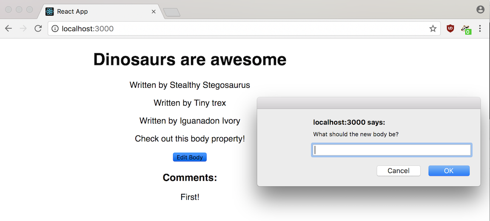

#  Blog Project: Implement State #

Let's implement state in our blog.

<aside class="notes">

**Talking Points:**

- Let's implement state in our blog by making `body` a mutable value.
- Remember to switch the running application!

</aside>

---

### But First: What Would Happen to State if You Refreshed the Page?

<aside class="notes">

**Talking Point:**

- In React, state just represents the state of data on our page.

- Something saved to state in React is not automatically saved to a database or to local storage. 

- State is just what's currently on the page. If you refresh the page, then all state is lost and refreshed with the page.

</aside>

---

### Steps

1. Set an initial state for our `Post` component. 

2. Modify `Post`'s `render()` method so that it uses the `body` from state, not props.

3. Create a `changeBody()` method inside `Post` that updates `body` based on a user's input.

4. Add a button to `Post`'s `render()` method that triggers `changeBody()`.

<aside class="notes">

**Talking Points:**

1. Set an initial state for our `Post` component. The `state` object should have an attribute called `body`. Remove the prop we set for `Post` and put it into the initial state instead. The value of `this.state.body` should be `Check out this body property!`.

2. Modify `Post`'s `render()` method so that it uses the `body` from state, not props.

3. Create a `changeBody()` method inside `Post` that updates `body` based on a user's input.
  - You should use `setState` somewhere in this method.
  - How can you get user input? Keep it simple and start with `prompt`.

4. Add a button to `Post`'s `render()` method that triggers `changeBody()`.

</aside>

--- 

## Solution

<aside class="notes">

**Talking Point:**

- This is what your solution should look like.

</aside>

---

## Bonus

Use a form to take in user input.

> Helpful documentation is available [here](https://reactjs.org/docs/forms.html).

<aside class="notes">

**Talking Points:**

- The blog post's `body` should be updated dynamically when the user types in an input field.
- One option is to keep track of what the new input is going to be by triggering a method using `onChange` on the `<input>`.
- Another option is to pass an `event` object to the `onSubmit()` method and traverse the DOM from the event's target (for example, `e.target`) to find the `<input>` value.
- Note: You can leave the button from above to give the user options!

</aside>

---

## Bonus Solution

<aside class="notes">

**Talking Point:**

- This is what your solution should look like.
