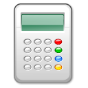

#  Exercise: Build a Calculator



Let's build a calculator — because we can!

<aside class="notes">

**Talking Points:**

- Now it's time for you to check back on everything you've learned. You'll be using React to build a calculator. I'll only provide minimal instructions — the heavy thinking is on you!

- At first, your calculator will just add two numbers together when you type them in. For the bonus, you might decide to get more creative.

</aside>

---


### Setup

`create-react-app`

### Step 1

```html
<div className="container">
  <h1>Add with React!</h1>

  <div className="add">
    <input type="text" />
    <span>+</span>
    <input type="text" />
    <span>=</span>
    <h3>Addition results go here!</h3>
  </div>
</div>
```

<aside class="notes">

**Talking Points:**

- Use `create-react-app` to make a new project.

- Then, create a single component file in the `src` directory and name it `Calculator.js`. In this file, create your `Calculator` class. Use the `App.js` as an example of how to create a basic component. Add the following JSX to your calculator's `render()` function.

</aside>

---

### Step 2

What `state` attributes will you need to track? 

What values should those `state` items start with? 

Where is that `state` displayed in the browser?

<aside class="notes">

**Talking Points:**

- Set up the initial `state` of your component. What `state` attributes will you
need to track? What values should those `state` items start with? Where is that
`state` displayed in the browser?

- Hint: You will only need one element in your `state` `state`.

</aside>

---

### Step 3

```js
class Calculator extends Component {
  // ...

  handleClick = (event) => {
    // Event logic here.
  }

  // ...
}
```

<details>

  <summary>More Info About `bind`</summary>

  You must explicitly `bind` functions with `this` in order for `this` to remain the same inside that function. If you're having trouble calling functions off `this` like `this.setState`, take time to consider why this is necessary. See if that leads you to, using the documentation, see how to do it.

```js
// This binding is necessary to make `this` work in the callback.
this.handleClick = this.handleClick.bind(this);
```

Revisit the To-Do List project to see how we previously reacted to changing
input text.

  <details>
    <summary>Hint: Where should the event binding go?</summary>
    In the same component as it's being used — in fact, right on the input.
  </details>
</details>


<aside class="notes">

**Talking Points:**

- Add an event to the inputs so that you can trigger a function when their values
change. Consider: Should it be a `click` event? A `submit` event? Something else?

- Here's some documentation to help you choose what you want to do and how to do it:

1. [A list of events React supports](https://facebook.github.io/react/docs/events.html#supported-events)
2. [React form documentation](https://facebook.github.io/react/docs/forms.html)
3. [How to handle events](https://facebook.github.io/react/docs/handling-events.html)

- Remember that when you create an event, the function you call should look something like what is seen here.

- Notice that the "How to handle events" link has an example using the `bind` keyword. This is an alternative and older way to handle events in React.

</aside>

### Step 4

Time to create a new method.

<details>

<summary>Hint: Where should this method go?</summary>
In the same component as it's being used — between the constructor and the render.
</details>

> Thought: How will you handle inputs that aren't numbers?

<aside class="notes">

**Talking Point:**

- Once you've chosen how to bind your inputs to an event, you'll need to create a
method. The method should accept the triggered event, get the input values from
your form, add them together, and set part of the `state` to the new `sum`.

</aside>

---

### Step 5

Et voilà!

<aside class="notes">

**Talking Point:**

- Once the `state` of the `sum` has been set, React will re-render the whole
component. Make sure you have a place in your JSX that displays the result.

---

### Bonus

- Make the calculator work with any of the four basic arithmetic operations
  (+, -, \*, /). How will this change your `state` and your JSX?
