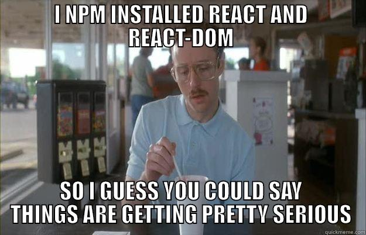

#  React Recap

<aside class="notes">

**Talking Points**:

- Don't worry - while there is a lot to see at first, React is a pretty straightforward framework to use. You can create user interface components that extend from `React.Component`. These have a built-in lifecycle that accepts data and can trigger automatic re-rendering whenever that data is updating. In a React Component, an update in either the State or Props will trigger the method cascade that can lead to a `render()`.

</aside>

---

### Best Practice 1

- Each component should be in a file unto itself. Don't put multiple components into one Javascript file.

---

### Best Practice 2

- Do not automatically render elements on the DOM *inside* its own component class definition.
 

<aside class="notes">

**Talking Points**:

- If you look through your files, you'll see in your component classes, you define a `render()` method for that component, which is great. That class then is called by `ReactDOM.render()` in **a different place, outside that class definition** (likely index.js).

- In some tutorials or older code, you may find examples of `ReactDOM.render()` inside a component, but you should avoid this at all cost; this was an older technique in past versions of React.

</aside>

---

### Best Practice 3

- Remember: State and Props are NOT the same thing. 
  
<aside class="notes">

**Talking Points**:

- Remember that `state` represents the _state_ of your user interface component.  Any value in your component that changes will be using `state`
- State can trigger changes in `props`, or `props` can come from parent components.

</aside>

---

### Best Practice 4

Remember: State can only be changed through the `this.setState`.  

<aside class="notes">

**Talking Points**:

- When working with reference data types such as Arrays and Objects, we must first create a new instance of our data since React expects our state to be **Immutable**

</aside>

---

### Best Practice 4

- When you are working with components that have no need for state, use a `functional component`.  

<aside class="notes">

**Talking Points**:

- This style of writing component still allows you to receive props, but doesn't come with the bloat of state and lifecycle methods.

</aside>

---

#### Last thoughts...

Think of a few websites you've seen. Would they benefit from using React?

<aside class="notes">

**Teaching Tip**:

[Video on When to Use React](https://generalassembly.wistia.com/medias/2qrtla3y8a)

(be sure to open it in a new tab)

</aside>

