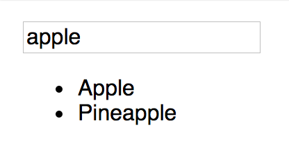
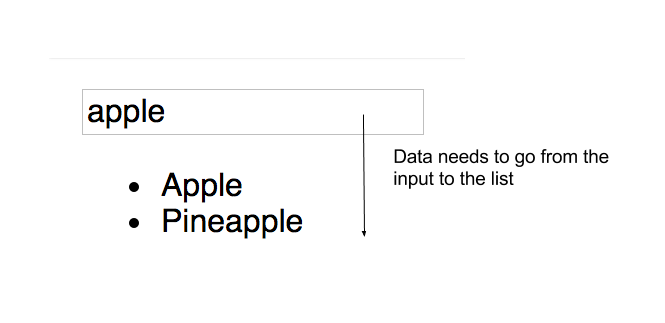

#  Unidirectional Data Flow

## Learning Objectives
*After this lesson, you will be able to:*
- Define unidirectional flow
- Diagram data in a component hierarchy


<aside>

**Talking Points**:

- What questions do we have about the component lifecycle?

</aside>

---

## What is Unidirectional Data Flow?

Let's start with [a video explaining this concept](https://generalassembly.wistia.com/medias/v2uenqkgwk).


<aside class="notes">

**Talking Points**:

- In React applications, data usually flows from the top down. How does this apply?

- When several components in a view need to share `state`, you lift, or **hoist**, the `state` so that it's available to all the components that need it. Define the state in the highest component you can, so that you can pass it to any components which will need it.

- Briefly describe the concept of 'hoisting' in JavaScript

- Let's look at a search filter as an example. This app will have two basic components - one that displays a list of data, and one that captures user input to filter the data.

</aside>

---

## I do: Build a Fruit Filter



<aside class="notes">

**Talking Points**:
- Our data will be simple - a list of fruits. The app will end up looking something like is seen here.

- When building a React app, it's important to take time to define the app's structure before you start writing code. I'm going to define the **components** and the **state** I need before I write the code.

---

## The Components

  1. A list component to display the list of fruit. 
  2. An input to capture the filter value from the user.
  
 <aside class="notes">

**Talking Points**:
- This app needs two components:
  1. A list component to display the list of fruit. This component needs one piece of data: the array of fruits to display.
  2. An input to capture the filter value from the user. This component needs one piece of data: the current value of the filter.
  
</aside>

---

## The State

This app needs to keep track of changes in two items:
  1. The filtered list of fruits
  2. The value of the filter

 <aside class="notes">

**Talking Points**:

- Review how to determine when we need a component and when we need to track state

</aside>

---

## Component hierarchy



 <aside class="notes">
 
 **Talking Points**:
 
 - I have two sibling components (components at the same level of the tree/app) that need to be aware of each other's data. Specifically, the list component needs to only show the fruits that match the filter value. So I need to get data from one sibling to another. Something like is seen here.
 
</aside>

---


 <aside class="notes">
 
 **Talking Points**:
 
 - How to achieve this, though? Using unidrectional data flow, of course! If I create a container component to hold both the filter value and the filtered list, I can hoist the `state` to the container so it's available to all the children. It will then be simple to display the `state` in the child components. The data will flow as seen here.
 
 </aside>

 ---

## Child components

```javascript
const FruitList = props => (
  <ul>
     {props.fruits.map(fruit => <li>{fruit}</li>)}
  </ul>
)

const FruitFilter = props => (
  <div>
    <label htmlFor="fruit-filter">Filter these Fruits: </label>
    <input type="text" value={props.value} onChange={props.onChange} name="fruit-filter" />
   </div>
)
```

<aside class="notes">
 
 **Talking Points**:
 
- Now that I know the components I need, the `state` I need, and where everything needs to be, I can start writing some code. First, I'll create the child components. I can use Functional components, since they won't need to hold their own state.

- `FruitList` renders an unordered list (`ul`) which contains an array of `li` elements, each with a single `fruit` string. `FruitList` uses [array map](https://developer.mozilla.org/en-US/docs/Web/JavaScript/Reference/Global_Objects/Array/map) to convert the array of fruit strings in our data to an array of fruit `li` elements to render. Using `map` to convert data arrays to arrays of UI elements is a common pattern you will use, and see used, in React.

`FruitFilter` renders a single input. Its value and onChange callbacks will both be set by the container component.

</aside>

---

## Container component


```javascript
constructor(props) {
    super(props);
    this.state = {
      // initialize the fruit list to the full list passed in props
      fruitsToDisplay: props.fruits,
      // intialize the filter value to an empty string
      filterValue: ''
    }
  }
```

<aside class="notes">
 
 **Talking Points**:
 
 - My container will be a class with a few methods I'll use to initialize and update the state of the two child components.
In the constructor, I'll initialize the state as seen here.

</aside>

---

```javascript
handleFilterChange(event) {
  event.preventDefault()
  const filterValue = event.target.value
  this.setState((prevState, props) => {
    // remove fruits that don't contain the filter value
    const filteredFruitList = props.fruits.filter(fruit =>
      fruit.toLocaleLowerCase().includes(filterValue.toLocaleLowerCase()))
    // return new state with the filtered fruit list and the new value of the filter
    return {
      fruitsToDisplay: filteredFruitList,
      filterValue
    }
  })
}
```

<aside class="notes">
 
 **Talking Points**:
 
 - I'll need a method to update the `state` when the filter value changes. This method will store the filter `state`, and filter the list of fruits to display. I'll pass this change handler to the filter component to react to user input.

</aside>

---

Finally, render the child components.

```javascript
render() {
    return (
      <div>
        <FruitFilter value={this.state.filterValue} onChange={this.handleFilterChange} />
        <FruitList fruits={this.state.fruitsToDisplay} />
      </div>
    )
  }
```

The full container component looks like this:

```javascript
class FruitContainer extends Component {

  constructor(props) {
    super(props)
    this.state = {
      // initialize the fruit list to the full list passed in props
      fruitsToDisplay: props.fruits,
      // intialize the filter value to an empty string
      filterValue: ''
    };
    // JavaScript cleanup: bind the context of our filterChange event handler (to have `this` to the context and handler we want)
    this.handleFilterChange = this.handleFilterChange.bind(this)
  }

  handleFilterChange(event) {
    event.preventDefault()
    const filterValue = event.target.value;
    this.setState((prevState, props) => {
      // remove fruits that don't contain the filter value
      const filteredFruitList = props.fruits.filter(fruit =>
        fruit.toLocaleLowerCase().includes(filterValue.toLocaleLowerCase()))
      // return new state with the filtered fruit list and the new value of the filter
      return {
        fruitsToDisplay: filteredFruitList,
        filterValue,
      }
    })
  }

  render() {
    return (
      <div>
        <FruitFilter value={this.state.filterValue} onChange={this.handleFilterChange} />
        <FruitList fruits={this.state.fruitsToDisplay} />
      </div>
    )
  }

}
```

<aside class="notes">
 
 **Talking Points**:

- All of the data is hoisted to the top of the tree in the container, and I pass
it to the child components.

</aside>

---

## You do: Also display the fruits that do _not_ match the filter

The full code for the fruit filter is
available at this CodePen: https://codepen.io/SuperTernary/pen/qjQVZM

<aside class="notes">
 
 **Talking Points**:
 
 - Once you have your data structured well, it's easier to add features to your
applications or make changes to them. Because all of our data lives at the top
of the tree, we can send it where we want. The full code for the fruit filter is
available [at this CodePen](https://codepen.io/SuperTernary/pen/qjQVZM).

- Fork the CodePen - you're going to add a feature.

- Add another child component to the `FruitContainer` that displays the fruits that do _not_ match the filter value
(this should be all the items that are not in the `fruitsToDisplay` list).

*Hint: Will you need to have a new state?*

</aside>

---

## Solution - Unmatching Filter

Solution code: https://codepen.io/SuperTernary/pen/mMWddo


```html
<div>
 <FruitFilter value={this.state.filterValue} onChange={this.handleFilterChange} />
 <p>Matching fruits:</p>
 <FruitList fruits={this.state.fruitsToDisplay} />
 <p>Unmatched fruits:</p>
 <FruitList fruits={this.state.unmatchedFruits} />
</div>
```

<aside class="notes">
 
 **Talking Points**:
 
- Here's a solution showing the Fruit list with two lists. One list shows fruits
matching the search term, and below that, the second list shows every other fruit left in
the list. The solution reuses the `<FruitList>` component to display a list of fruits,
except it is passed a different list of fruits.

</aside>

---

Now the app maintains two lists
of fruits:
- `fruitsToDisplay` shows all fruits that match the search
term.
- `unmatchedFruits` keeps track of which fruits don't match
the current search term.


```js
// remove fruits that don't contain the filter value
const filteredFruitList = props.fruits.filter(fruit =>
  fruit.toLocaleLowerCase().includes(filterValue.toLocaleLowerCase()))
// perform the opposite logic to create a list of fruits that don't match.
const unmatchedFruits = props.fruits.filter(fruit =>
 !fruit.toLocaleLowerCase().includes(filterValue.toLocaleLowerCase()))
// return new state with the filtered fruit list and the new value of the filter
return {
 fruitsToDisplay: filteredFruitList,
 unmatchedFruits: unmatchedFruits,
 filterValue,
}
```

<aside class="notes">
 
 **Talking Points**:
 
- Notice that in the constructor the app initializes the value of `unmatchedFruits` to just an empty list. Within `HandleChange`, we now need to update that list.

</aside>

---

## Final Thoughts

It's important that you think through your applications before you start writing
code. It's often helpful to sketch out your app, and identify:
- the **components**
you will need
- the **states** you will need
- where those states need to live

<aside class="notes">
 
 **Talking Points**:

- Use the unidirectional data flow pattern - hoist your state toward the top of the
component tree so it's available to the children that need it.

- Once you start coding your applications, be aware that your initial ideas might need to change and that is okay!

</aside>
