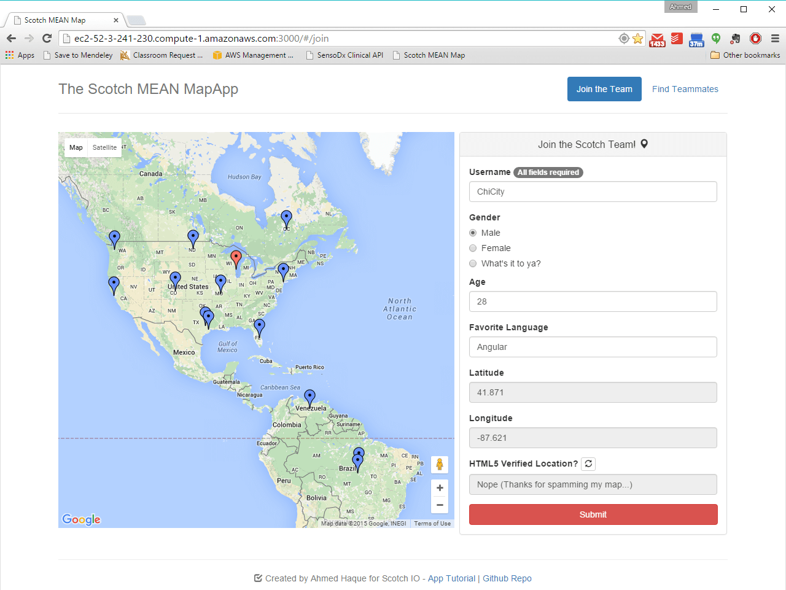
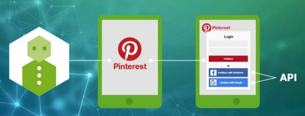
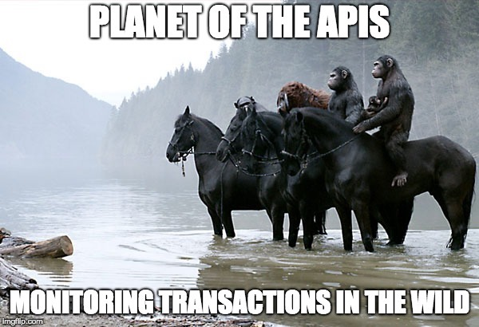
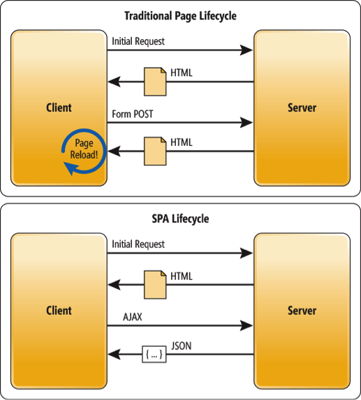

#  Introduction to APIs

## Learning Objectives

After this lesson, you'll be able to:

- Describe what an API is and why we might use one.
- Identify common APIs on the web.

## What Does API Stand for?

API stands for application programming interface.

<aside class="notes">

**Talking points**:

- API is a broad term. It's short for application programming interface and can be used to define everything from URL endpoints to DOM methods like `document.getElementById` and even the underlying methods and plugins that help your computer run.

- Over your development career, you'll see tons of references to APIs. Today, we'll learn about connecting to RESTful APIs through HTTP requests.

- Basically, an API is a service that provides raw data for public use. As third-party software developers, we can access an organization's API and use their data within our own applications.

</aside>

---

## Web APIs

 
 Image Credit: [Signity Solutions](http://www.signitysolutions.com/blog/miscellaneous-posts/what-is-an-apis-and-cms/) 

<aside class="notes">

**Talking points**:

- When we think about web APIs, we're thinking about communicating with servers that can send and receive data. Let's look at an example.

</aside>

---

  
 Image Credit: [Build a MEAN App with Google Maps](http://www.signitysolutions.com/blog/miscellaneous-posts/what-is-an-apis-and-cms/) 

<aside class="notes">

**Talking points**:

- Imagine you want a Google map embedded in your web app. You aren't going to make that map yourself, so somehow you have to use Google Maps. Google Maps has an API you can call to get the map information. All you have to do is send a request to the Google Maps API and it sends back a map that you can use.

**Teaching tips**:

- Given time, feel free to mention that SDKs for popular APIs exist for specific frameworks. [google-maps-react](https://github.com/fullstackreact/google-maps-react) is a popular example.
- Make sure to mention the caveat that by using a third-party SDK, you're giving up control to a "black box." This means that if the Google Maps API changes and the SDK does not, then you're in for trouble as a developer.

</aside>

---

## Why Use APIs?

 
 Image Credit: [Anuschka Diderich-Rijnsburger](https://www.slideshare.net/AnuschkaDiderichRijn?utm_campaign=profiletracking&utm_medium=sssite&utm_source=ssslideview) on SlideShare 

<aside class="notes">

**Teaching tips**:

- This class doesn't cover any back-end development, but this would be a good opportunity for you to give an example of how you interacted with a custom-made API in the past.

**Talking points**:

- APIs can make development faster. Why recreate data when we don't have to? Think about past projects or ideas that would be easier if you could pull in data already gathered elsewhere.

- APIs can provide us with data that we wouldn't otherwise be able to create ourselves.

- As we move into building single-page applications, we'll be relying more on both third-party APIs and APIs that we can create using back-end programming languages.

</aside>

---

## API Exploration

| What's the API? | Sample URL - you call this |
|------|------------|
| **[Giphy's API: request a list of all funny cats](https://github.com/Giphy/GiphyAPI)** | http://api.giphy.com/v1/gifs/search?q=funny+cat&api_key=dc6zaTOxFJmzC |
| **[The Star Wars API: request R2-D2 info](http://swapi.co/)** | http://swapi.co/api/people/3 |
| **[Markit Digital's API: request current Apple stock info](http://dev.markitondemand.com/Api/Quote/xml?symbol=AAPL)** | http://dev.markitondemand.com/Api/Quote/xml?symbol=AAPL

<aside class="notes">

**Talking Points**:

- There are a variety of APIs available on the internet. To call an API, send a request to a URL, and that API will return data to your program. You can pull data from anywhere that offers an API.

- You can make this request as specific as you'd like - each web app out there offers different options for their API. You just have to find out from them what you can request!

- Here are just a few examples of APIs that you can use. Check it out - the left column is the common name you might know. The right column is the URL you, in your program, would send a request to. 

**Teaching Tips**:

- Does the JSON look unreadable in the browser? If you're using Chrome, install the [JSON View plugin](https://chrome.google.com/webstore/detail/jsonview/chklaanhfefbnpoihckbnefhakgolnmc?hl=en).

- Click the URLs in the table to show students what each call would return.

- Make sure to also get rid of the API key query param when requesting Giphy so that you can show what a response looks like when a key is not provided.

- Unless the class is already versed in making API calls, it's likely that they do not have JSONView.  Make sure to spend the time to make sure the students have this plugin.

- Alternatively, have the students download [Postman](https://www.getpostman.com/) and give a brief overview.

</aside>

---

### Building on the Shoulders of Giants

- Google Translate API: https://cloud.google.com/translate/
- IBM Watson: https://developer.ibm.com/watson/
- Azure Cognitive Services: https://azure.microsoft.com/en-us/services/cognitive-services/

<aside class="notes">

**Talking points**:

- One of the advantages of using APIs is easy access to revolutionary resources that can be used in your own personal projects.

- Seen here are a few examples of resources available to you once you begin to take advantage of APIs.

</aside>

---

### Turn and Talk: API Exploration

- Public APIs: https://github.com/abhishekbanthia/Public-APIs
- Curated list of APIs: https://medium.com/@benjamin_libor/a-curated-collection-of-over-150-apis-to-build-great-products-fdcfa0f361bc

<aside class="notes">

**Talking points**:

- Take some time to explore public APIs that exist online. Search Google or use an API aggregator to find interesting APIs. Post anything you find to Slack.

**Teaching tip**:

- Send the URLs to students through Slack for quick access.

</aside>

---

### APIs in the Wild

Can you think of any websites you go to that pull information from other places (and probably use an API)?

<aside class="notes">

**Teaching tip**:

Suggested examples:

- [IFTTT](https://ifttt.com/)
- [Hootsuite](https://hootsuite.com/)

</aside>

---

## Describe How an API Fits in With SPAs

 
Image Credit: [Zanon.io](https://zanon.io/posts/angularjs-how-to-create-a-spa-crawlable-and-seo-friendly)

<aside class="notes">

**Talking Points**:

- In a traditional, server-side-rendered application, the server retrieves data from the database and uses that information to format the HTML on the server side. <!-- (Demo https://www.amazon.com). -->

- Now, a server retrieves the data from the database and responds to requests with JSON. <!-- (Demo http://www.swapi.co/). -->

- We can use various web-based APIs to populate our SPAs with data asynchronously. This way, the user can interact with the application and see it respond with new data without needing to refresh or navigate to a new page <!-- (demo [/starwars](/starwars)). -->
