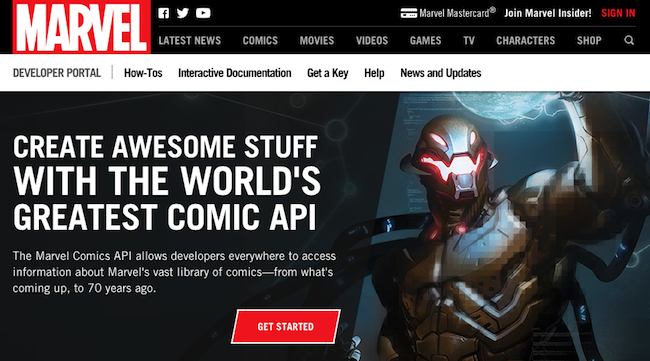

#  Transferring Data

## Learning Objectives

*After this lesson, you will be able to:*

- Contrast JSON and XML
- Describe API keys

---

## Return Format

<br>
<sup>Image Credit: [All Things Clipart](http://www.allthingsclipart.com/09/waiting.clipart.htm)<sup>

<aside class="notes">

**Talking Points**:

- No user likes when they're on a page that takes forever to load. If your web app has a Google Map, a list of movies from IMDB, and a Spotify catalog — that's a lot of information. You want the information returned as quickly as possible so that users aren't waiting forever for your page to load.

- All of this information — from all of these browsers and all of these servers — has to travel through the network. That's almost certainly the slowest part of the request cycle. We want to minimize the bits. There are times when we just need the data, and in those cases, we want a concise format.

- When working with Single Page Apps, we will only load the very bare minimum of HTML and CSS to let the user know the page is loading.  Then we will make our API calls and flesh out the rest of the page as the data comes in.

</aside>

---

### How APIs are Read

#### _JSON_ and _XML_

<aside class="notes">

**Talking Points**:

- All data sent via HTTP are strings. Unfortunately, what we really want to pass between web applications is **structured data** (i.e., arrays and hashes) (because it makes much more sense to us!). Thus, native data structures can be **serialized** into a string representation of the data. Serializing refers to taking a giant string of data and turning it into something readable and useful.

- There are two major serialized data formats that you will typically encounter: _JSON_ and _XML_.

</aside>

---

#### JSON

```json
{
  "users": [
    {"name": "Wonder Woman", "id": 0},
    {"name": "Black Panther", "id": 1},
    {"name": "Batgirl", "id": 2}
  ]
}
```

<aside class="notes">

**Talking Points**:

- **JSON** stands for "JavaScript Object Notation" and has become a universal standard for serializing native data structures for transmission. It is light-weight, easy to read and quick to parse. JSON looks like this - it's easily readable and information is separated with braces {} and commas.

- Remember, JSON is a serialized format. While it may look like an object, it needs to be parsed so we can interact with it as a true Javascript object.

</aside>

---

#### XML

```html
<users>
  <user id="0">
    <name>Wonder Woman</name>
  </user>
  <user id="1">
    <name>Black Panther</name>
  </user>
  <user id="2">
    <name>Batgirl</name>
  </user>
</users>
```

<aside class="notes">

**Talking Points**:

- **XML** stands for "eXtensible Markup Language" and is the granddaddy of serialized data formats (itself based on HTML). XML remains a major format due to its legacy usage across the web.

- XML has an idea of open tags and close tags - just like HTML.

</aside>

---

`https:///api/index.php?output=json` or
`https:///api/index.php?output=xml`

<aside class="notes">

**Talking Points**:

- You've probably guessed that most developers favor using a JSON API, if available. Conveniently, many APIs publish data in multiple formats and let you specify which you'd like. See the examples here.

</aside>

---




- Marvel Comic's API: http://developer.marvel.com/documentation/getting_started

- Programmable Web API Directory: http://www.programmableweb.com/apis/directory

- XML-to-JSON Conversion Tool: https://www.npmjs.com/package/xml2json

<aside class="notes">

**Talking Points**:

- Chances are good that most major content sources you follow online publish their data in some type of serialized format. [Even Marvel Comics publishes an API](http://developer.marvel.com/documentation/getting_started). Look around for a "Developers" section on major websites. Or, if you'd like a cheat sheet you can try the [Programmable Web API Directory](http://www.programmableweb.com/apis/directory).

- Generally, try to always use JSON APIs if they are available.  If they are not, there are some great tools to help convert XML like [xml2json](https://www.npmjs.com/package/xml2json)

</aside>

---

### Authentication

            

<aside class="notes">

**Talking Points**:

- While the majority of APIs are free to use, many of them require an API "key" that identifies the developer requesting data access.

- Some APIs, such as Spotify's music catalog, might seem like they should be available for anyone to access, but imagine if PayPal had an API that shops could request your money from.

- Now imagine Etsy calls PayPal when you buy something. You'd want Etsy to have to prove it was actually Etsy, right? You don't want anyone to be able to pretend to be Etsy, go to PayPal, and charge you $500. Instead, you'd want Etsy to somehow authenticate to PayPal.

- This is accomplished by giving Etsy a private key to use at PayPal that only Etsy knows. Every time Etsy makes a request to PayPal, Etsy can say, "Hey, I'm requesting this. Here is my proof that I'm allowed to do so."

</aside>

---

### Getting an API Key


#### GIPHY API: https://api.giphy.com/

* No key: [http://api.giphy.com/v1/gifs/search?q=funny+cat](http://api.giphy.com/v1/gifs/search?q=funny+cat).

* Now try with a key: [http://api.giphy.com/v1/gifs/search?q=funny+cat&api_key=dc6zaTOxFJmzC](http://api.giphy.com/v1/gifs/search?q=funny+cat&api_key=dc6zaTOxFJmzC)


<aside class="notes">

**Talking Points**:

- Many APIs require a key. This is done to regulate usage and prevent abuse. Some APIs also rate-limit developers, meaning they have caps on the free data allowed during a given time period.

- Let's look. Try hitting the [Giphy](https://api.giphy.com/) API. You can just click these - it's documentation to show you how it's done.

- No key: [http://api.giphy.com/v1/gifs/search?q=funny+cat](http://api.giphy.com/v1/gifs/search?q=funny+cat).

- You get back, in the center of the string: *"error_code":"invalid_api_key"* (and, on a note, it's in JSON formatting). The rest of the string is just more information.

- Now try with a key: [http://api.giphy.com/v1/gifs/search?q=funny+cat&api_key=dc6zaTOxFJmzC](http://api.giphy.com/v1/gifs/search?q=funny+cat&api_key=dc6zaTOxFJmzC)

- You get back the list of funny cats - still JSON formatting.

- It'd be more readable if we added new lines between cat gifs in the list, but that's not automatic.

**Teaching Tips**:

- If possible, walk through the steps to generate an API key with Giphy.  It's pretty easy to get a key, but requires creating an account.
- Make sure to emphasize that all APIs that use keys have their own way of generating them. Some are easy to get, like Giphy. Others are difficult and you may even have to e-mail the developers of the app themselves.

</aside>

---

### Important note!

#### Store those keys someplace private.

<aside class="notes">

**Talking Points**:

- When you are calling APIs that require a key, it's up to you to store those keys somewhere private. They are the only proof that you are you and you are allowed to call that API, after all.

- For example, it is very important that you not push your API keys to a public Github repo.

- This is especially true when working with [Amazon Web Services (AWS)](https://aws.amazon.com/). Here's an example of a [stolen key horror story](https://wptavern.com/ryan-hellyers-aws-nightmare-leaked-access-keys-result-in-a-6000-bill-overnight).

</aside>


