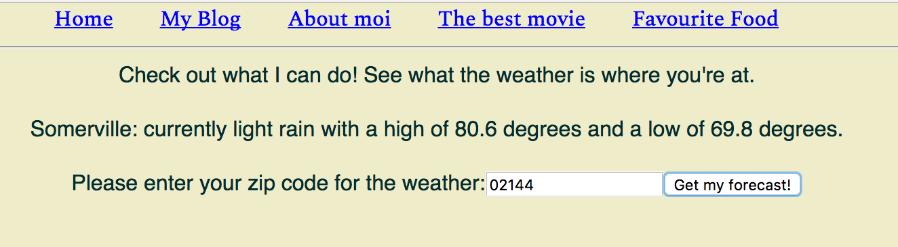

#  Exercise: Displaying the Weather

## Implement the ES6 fetch API

 

#### Resources

- OpenWeather API: http://openweathermap.org/current

- Documentation: http://openweathermap.org/current

- Info on `fetch`: https://developer.mozilla.org/en-US/docs/Web/API/WindowOrWorkerGlobalScope/fetch

<aside class="notes">

**Talking Points**:

- Time to show off! You're going to display the weather on your About page.

- You will use the [OpenWeather API](http://openweathermap.org/current) to fetch the weather from a certain zip code and update the home page to reflect the current weather.

- Here is the [documentation for the weather API](http://openweathermap.org/current).

- If you'd like, you can read about `fetch` in general on MDN [here](https://developer.mozilla.org/en-US/docs/Web/API/WindowOrWorkerGlobalScope/fetch).

</aside>

---



<aside class="notes">

**Talking Points**:

- At the end of this exercise, your solution will look something like what is seen here.

</aside>

---

### Requirements

On your "About" page, ask the user to input a zip code.

- You can also learn about forms [here](https://facebook.github.io/react/docs/forms.html).
  - When this event fires, take the `event.target.value` and `fetch()` from the OpenWeather API.

- Use the response to display the current temperature, the high and low temperate, the current weather description, and the name of the city that came back from the API.
  - Note: Our solution uses Fahrenheit - you're free to use Celsius if you'd like.

**IMPORTANT NOTE**: Because the OpenWeather API is not an open API, every request must end with this API key:  `&appid=052f26926ae9784c2d677ca7bc5dec98`  (i.e. this is a URL you might send a `fetch()` request to: `http://api.openweathermap.org/data/2.5/weather?zip=60614,us&appid=052f26926ae9784c2d677ca7bc5dec98`).

<details>
  <summary>Skeleton Code</summary>

  ```js
import React, { Component } from 'react';

class About extends Component {

  this.state = {
     // your required states here
  }

  handleChange = (event) => {
    this.setState({zipcode: event.target.value})
    console.log('Your zip code is' + this.state.zipcode)
  }

  handleSubmit = (event) => {
    // your fetch here
    // your state updates go under function(json)
  }

  render() {
    return (
      <div>
        <form onSubmit={this.handleSubmit}>
        <p>
          // display weather information here
        </p>
        <label>
          Please enter your zip code for the weather:
          <input type="text" onChange={this.handleChange} />
        </label>
        <input type="submit" value="Get my forecast!" />
      </form>
      </div>
    )
  }
}


export default About

```

</details>

<aside class="notes">

**Talking Points**:

- **Hint 1:** You'll only need to re-work the About component. Nothing else needs to change.

- **Hint 2:** To see a skeleton of this (to see how to handle the form), see below.

</aside>

---

### Optional:


<aside class="notes">


**Talking Points**:

- Spend a little time styling the page. Here's some inspiration (Don't worry about the lens flare!)
