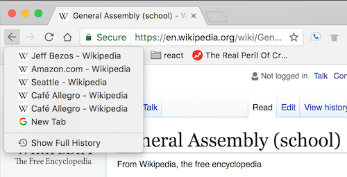
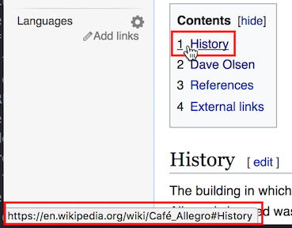

#  Browser History Mechanics and Single-Page Applications

## Learning Objectives
After this lesson, you'll be able to:
* Compare old browser history mechanics to modern browser history mechanics.
* Define routing.
* Define single-page applications (SPAs).
* Explain why old browser history mechanics don't work for SPAs.

---

## Browser History Mechanics

Browsers have built-in history mechanics. You can go **back** and **forward** between pages you've visited and you can **reload** the page you're on.

It's important to note what a page is.
- A page is a whole HTML file that your browser loads and displays. You know you're navigating between two different pages when you see your browser screen go blank then slowly load a completely new page.

Open a new tab and navigate here: https://en.wikipedia.org/wiki/Café__Allegro.

<aside class="notes">

**Talking points**:

* Open a new tab in your browser and navigate to the Wikipedia article for Cafe Allegro in Seattle.
* Hover over the link to the "Seattle" entry near the top of the article and look at the URL.
* Notice that the URL says `wikipedia.org/wiki/Seattle`. It doesn't include `Cafe_Allegro`, and there's no hashtag. This URL takes us to an entirely different page.
* Click the link to "Seattle" and notice how your browser goes blank and loads another page, which is also full of links to other articles.
* Click on several more links, paying attention to when the browser goes blank and loads a completely new page.
* Hold down your mouse on the **back** button. You'll see a dropdown menu showing every page you've been on.
  
</aside>

---

Holding down the back button to look at your browser history should show
something like this:

**Talking points**:

* Browser history mechanics are built for going **back** and **forward** between different pages (using arrows). These actions are also available to us in JavaScript. We can write JavaScript programs that invoke `window.history.back()` and `window.history.forward()`.
* For instance, when moving from the Cafe Allegro page to the Seattle page on Wikipedia, the browser goes blank and loads a completely new page. Browsing pages on one site is like viewing different articles on Wikipedia — you haven't left the Wikipedia site; you're just looking at different pages on it. Meanwhile, browsing pages on different sites is like using a search engine to look up a restaurant, checking out the restaurant's reviews on Yelp's website, and then looking at the restaurant's official website. In this case, the browser is visiting different **pages** on different **sites**.
* We can see the history of the pages we've visited by holding down the back button.
* This seems pretty straightforward, right? However, the rise of recent approaches to websites — like React — broke old, traditional browser history mechanics and led to the introduction of new ways for websites to control what **back** and **forward** really mean.
* Let's explore.

</aside>

---

## URL Routing

With **routing**, content is displayed when someone visits a certain URL.
-  `http://github.com/` versus `http://github.com/login`

These are two different pages on the same site, and each of these URLs is a **route**.

<aside class="notes">

**Talking points**:

* Routing defines what content is displayed when someone visits a certain URL.
  - If you go to `http://github.com/`, you expect to see GitHub's home page.
  - If you go to `http://github.com/login`, you expect to see a login page.
* A route pairs a URL with the content that should be displayed for that URL. If you visit a webpage, copy the URL, and send it to a friend, your friend should end up viewing the same page.

</aside>

---

| **URL Route**                       | **Content**                                              |
|-------------------------------------|----------------------------------------------------------|
| /                                               | Home page                                    |
| /about                                          | General information                          |
| /education                                      | Shows all upcoming local courses             |
| /education/web-development-immersive            | Web Development Immersive course details     |
| /education/user-experience-design-immersive     | User Experience Design Immersive course details|
| /locations                                      | Shows all global GA locations                |
| /locations/london                               | Shows London-specific location information   |
| /locations/singapore                            | Shows Singapore-specific location information|

<aside class="notes">

**Teaching tips**:

* Go to [General Assembly's website](https://generalassemb.ly/). Interact with the menu in the top bar on the right.
* You should see options for things like "On Campus," "Locations," and "About." Click on the different links to pages and point out the URLs that you end up at, or hover over the links to see their URL. Draw students' attention to the paths.
* Compare the paths in the URLs and get a sense of how URLs are routed to content. Website URLs are generally split into succinct, descriptive, and hierarchical categories. Notice how going to `/locations` takes you to a page showing all campus locations, then each specific location falls in a hierarchy under that such as `/locations/london` and `/locations/singapore`.

**Talking points**: 

* Let's look at the General Assembly home page for an example of how content is routed by URLs.
* Notice that each section (like "On Campus" and "About") has new information after the domain name. This is called the **path**.
* This table shows the path for each URL. In this case, the path is everything that appears after "https://generalassemb.ly" in the location bar of the browser. The `/` is a special path called the root. It loads the home page.
* You can see that URLs **route** users to content. When someone types in a URL, they're ultimately shown content associated with that URL.
* URLs should represent the main content of the page you're looking at.

</aside>

--- 

Old websites:
- Spread their content across multiple pages.
- Use URLs to route users to different pages.
- Can use URLs with hashtags to take the user to different content on the same page.

 

<aside class="notes">

**Teaching tips**: 

* Open a new tab in your browser and navigate back to the Wikipedia article for [Cafe Allegro](https://en.wikipedia.org/wiki/Cafe_Allegro) in Seattle. Hover over the "History" link under the "Contents" section.
* Click on the "History" link.

**Talking points**:

* Old websites spread content across different pages and each URL routes users to those pages.
* Take a look in the lower-left corner of my browser. Notice the URL is `wikipedia.org/wiki/Cafe_Allegro#History`. Specifically note the hashtag `#History`.
* Notice that when I click on the "History" link, it scrolls down within the same page. This still counts as a route even though it's navigating to a new section on the same page.

</aside>

## Modern Single-Page Applications

Modern web apps serve up just one page and then change parts of its contents without having to reload the entire page or send users to another page. These are called **single-page applications**.

<aside class="notes">

**Talking points**: 
* Now, consider webpages where, depending on what you click, the actual content of the page dynamically changes — the page itself never reloads.

* Websites that serve up only one page and change the content of the page dynamically without reloading it are called **single-page applications**.

</aside>

---
### Activity 

Take three minutes to find an example of a single-page application. 

<aside class="notes">

**Teaching tips**: 
* Give students three minutes to find an example of an SPA. Give them hints if they need it, but this activity should demonstrate that they're more common than they seem.
* Elicit responses before moving on. Correct examples that aren't SPAs.

</aside>

---

Gmail fits the definition of a single-page application.
- Gmail loads a page just once.
- That page replaces content dynamically to show you many different things.
- That single page changes its content dynamically without reloading or sending you to another page.

<aside class="notes">

**Talking points**: 

* When you load Gmail, you see your inbox.
* You can start chatting with a friend on the sidebar.
* You can compose a new email to your manager to request time off.
* You can search for an email with flight information.
* You can browse through more emails to make sure you've talked to your manager about getting time off and aren't just disappearing for a week.
* This all happens on one page. The page never refreshes. The chat bar with your friend never disappears as you compose an email and search through your inbox.

</aside>

--- 

Consider the benefits of a single-page application:
* It's fast.
* It's persistent.

<aside class="notes">
  
**Talking points**:

* Fast: Users don't have to wait for a page to reload over and over.
* Persistent: You can have a chat window open in one corner and keep talking to a friend as the rest of Gmail switches between showing you your inbox, an email, or email search results.
 
</aside>
  
 ---
## Single-Page Applications Break Old History Mechanics

Imagine being on Wikipedia, going to Gmail, going through several views of different email inboxes and search results, and then pressing the back button. This process would go something like this:

* Go to wikipedia.org.
* Type in www.gmail.com to check your email.
* Click on one email.
* Search your inbox for a certain email.
* Open that email.
* Click the back button on your browser to go back to the search results.
* Wait — you end up at Wikipedia.

<aside class="notes">

**Talking points**:

* Now here's the catch and why we went into such detail about browser history mechanics and defining exactly what SPAs are: single-page applications break the initial design of browser history mechanics.
* Why is this? The **back** and **forward** actions were built specifically to go back and forth between different pages. Since single-page apps only change their content without actually sending users to different webpages, the notion of **back** and **forward** is lost.
* Gmail and most email apps are single-page applications. Despite the content changing, you're always on gmail.com. Because of modern browser history mechanics (the ones we've learned so far), pressing the back button will take the user to the last URL they visited — in this case, Wikipedia — when the user just wants to go back to their email search results.

</aside>

--- 

## Introducing Modern Browser History Mechanics

Developers need to create fast-loading web applications, but somehow still make the back button work.

The modern HTML5 specification (published in October 2014) introduced new browser history mechanics that make it easy to browse back and forward in single-page applications, even while actually staying on the same page.

<aside class="notes">

**Talking points**:
* Web developers, browser vendors, and users (even if they don't know it) all love single-page applications. They're a great experience that the community is embracing. To facilitate them and still have things like the back button work, people got together in committees and devised a way to upgrade the old browser history mechanics to accommodate modern SPAs.

</aside>

---

### How?

HTML5 introduced:
- `.pushState()`  
- `.replaceState()`

<aside class="notes">

**Talking points**:
* These are functions that allow webpages to save custom history data to the browser.
* Applications like Gmail can use these functions to manually save custom browser history. For example, Gmail can use `.pushState` to put a user's email search results page in the browser history. So when the user opens an email and clicks on the back button, they're taken to the search page on Gmail and not to the last website they visited.
* When someone goes from their inbox to a specific email, Gmail can use `.pushState` to save information in the browser about what the user is currently doing in the application. So when the user presses the back button, the browser returns the saved information to Gmail and Gmail loads the previous content the user was looking at.

</aside>

--- 

## Recap
Here's a summary of what we've learned so far:

* Single-page applications are websites that serve only one webpage then change the content of that page dynamically.
* Old browser history mechanics support back and forward operations that traditionally keep track of history as users move between different pages.
* Since modern SPAs keep users on one page without refreshing old browser history, back and forward browser mechanics don't work
  well with modern applications. So HTML5 changed the rules of how back and forward work.
