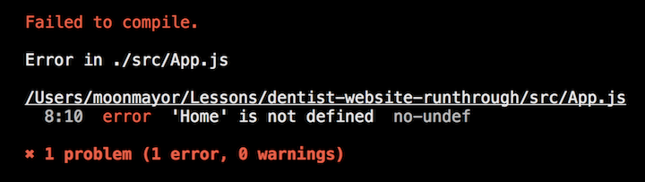

#  Exercise: Build a Dentist Website, Part 1 


<aside class="notes">

**Talking Points**:

* We'll make a sample dentist website that has a `Home` page, a page listing available `Procedures`, and a page displaying `Contact` information. Each page will be built into its own regular React component. Then, we'll create a unique URL route that leads to each component.
* When you're done, it should look like what you see here.
* You can see a live working copy of the site [here](https://react-router-dentist.herokuapp.com/).

</aside>

---

Here's how we'll route our single-page application:

| **URL Route**  | **Component**  | **Content Description**                          |
|----------------|----------------|--------------------------------------------------|
| /              | `<Home>`       | A home page with welcome text.                   |
| /procedures    | `<Procedures>` | A list of all dentist procedures.                |
| /contact       | `<Contact>`    | A page with a business address, phone number, and email address. |

<aside class="notes">

**Talking Points**:

* Remember, the URL routes are paths off our main website. We could put our website at any domain, like `www.ourdentistwebsite.com` or `www.premiumdental.com`, and the URL route paths would behave the same. Paths only care about what comes after the domain name.
* Our routes say that if someone goes to `ourdomain.com/`, they'll see our home page with welcome text.
  - The content of this page will be defined in its own `Home` component in a file called `home.js`.
  - If someone navigates to the URL `ourdomain.com/contact`, they'll see content with a business address, phone number, and email address. All of this content will be defined in a `Contact` component in a file called `contact.js`.
* In this code-along, we'll walk through building this out together.
* You'll be following along so you end up with a locally working React Router application. However, if you'd like to refer to the finished code at any point, you can see all of it [here](../../../react-router-simple-dentist-site).


</aside>

---


## In Your Terminal

> Remember to stop the React project you currently have running.

In your terminal, use `create-react-app` to make a new project called `dentist-website`:

```
$ create-react-app dentist-website
$ cd dentist-website
$ npm start
```
<aside class="notes">

**Talking Points**:

* Your browser should open to <http://localhost:3000/>, and you'll see the standard "Welcome to React" message with a fancy rotating atomic icon. `create-react-app` creates several files for us in a directory called `src`.

* Open the `App.js` file in your editor. Remember, `App.js` contains our main application (it's what's called by `index.js`). You should see the basic JSX structure of the standard React starter page. Make sure the file is the same thing you're looking at in the browser by finding the `Welcome to React` text inside an `<h2>` element.

* Change the text to say `Hello!`, save the file, and make sure you see the changes automatically appear in your browser. If it doesn't automatically refresh, try manually refreshing the page. If you still don't see changes after a manual refresh, then something could be wrong. Make sure you're editing the right file.

* It's a good sanity check to make simple, verifiable changes like this when you begin a project. Don't start with complex changes that come with greater potential for error. Prove to yourself the small changes work and you'll save yourself headaches that come with debugging larger ones.

</aside>

---

## Installing React Router

Let's install **React Router**.

Hit `ctrl-c` to stop the running app so we can use the terminal.

Because React Router is a third-party library, we'll need to download and save it as a dependency in our project.

In your terminal, enter:

```sh
$ npm install --save react-router-dom
```

<aside class="notes">

**Talking Points**:

* `npm install` is the command used to install libraries to our project.
  - The `--save` flag tells `npm install` to save what we're downloading to our `package.json` file as a dependency. Saving the library as a dependency makes it easy for us to copy our project to another machine and simply run `npm install` to install all of the dependencies for our project.
  - `react-router-dom` is the official name of React Router.

* So in summary, we're telling `npm install` to find the library package called `react-router-dom`, install the package, and save the name of the package to our file that keeps track of all the packages for our project.

* If you don't use the `--save` flag, `npm install` will still find the package and download it. It just won't save the package to your `package.json` file, which allows you to easily install all of your saved dependencies if you later move to another machine.

</aside>


---

## Create a Custom Home Page

Let's start the app again. Enter the command `npm start` in your terminal.

Let's get rid of the standard "Welcome to React" page and replace it with our own dentist website home page. Continue editing `App.js` to take out most of the JSX contents and delete the `import` statement for `logo.svg`, which we won't use.

<aside class="notes">

**Talking Points**:

* The `App.js` file contains one component where our whole app will live. Remember that React components have a `render()` function that defines what they will look like when rendered on a webpage.
* Reminder: The `render()` function must always return **at most** one top-level element. It's common to wrap everything in your component in a `div` to make sure you satisfy this constraint.

</aside>

---

Let's add one `<h1>` that says `Dentist Website` and a paragraph with some short welcome text. Your `App.js` file should look like the code below. Save the file and check your browser to make sure the changes show up.

**App.js**
```js
import React, { Component } from 'react';
import './App.css';

class App extends Component {
  render() {
    return (
      <div>
        <h1>Dentist Website</h1>
        <p>
          Welcome to my dentist website.
        </p>
      </div>
    )
  }
}

export default App
```
<aside class="notes">

**Talking Point**:

* Great! Now we have a simple home page. Let's move on to setting up the rest of our site's content.

</aside>

---

## Creating Our Home Page Component


1. Create a new file called `Home.js`.
2. Copy and paste everything inside `App.js` into `Home.js` to use as a template for creating a React component.
3. Delete the `import` statement for `./App.css`.
4. Find all instances of `App` in the file and replace them with `Home`. This code previously created a component called `App`, but we're rewriting it to create a component called `Home`.
5. Nothing needs to change for the rest of the `Home` component. You can look at the `render()` function and verify that it's returning content that represents our home page. It should be a top-level `<div>`, the `<h1>`, and a `<p>` paragraph element (if you used the same content we did).
6. Go back to the `App.js` file and delete the `<h1>` and `<p>` tags where we used to have content written directly inside of our `App` component. We no longer need that written inside `App` because we moved it all to the new `Home` component.
7. Instead, we need to call our new component. Put `<Home></Home>` inside the `<div>` in the `App` component. This tells the `App` component to render the `Home` component right inside the `<div>`.
  > Note: We've been using `<Home />` to call components. `<Home></Home>` is just a different syntax we're showing you so that, if you see it elsewhere, you're familiar with it.
8. Let's try it out. Look at the browser and see if the home page appears. Unfortunately, if you've been following along, it won't. You'll see an error, which should look like this:



<aside class="notes">

**Talking Points**:

* We've been editing `App.js`, which defines one component for our entire application. So far, our app manually shows the home page. Let's refactor this so that the home page's content is moved into its own component called `Home`.

* It's not enough to simply create the `Home.js` file and the `Home` component. We must also remember to import the component into the `App.js` file. Any components you want to use in a file need to first be imported into that file.

</aside>

---

**App.js**
```js
import React, { Component } from 'react';
import './App.css';
import Home from './Home';

class App extends Component {
  render() {
    return (
      <div>
        <Home></Home>
      </div>
    )
  }
}
export default App
```

**Home.js**
```js
import React, { Component } from 'react';

class Home extends Component {
  render() {
    return (
      <div>
        <h1>Dentist Website</h1>
        <p>
          Welcome to my dentist website.
        </p>
      </div>
    )
  }
}

export default Home
```

<aside class="notes">

**Talking Point**:

* Your `App.js` and `Home.js` files should look like this after you've properly created and imported the `Home` component.

</aside>

--- 

## Create Components for Procedures and Contact
 
We'll create two more components, then we'll start routing things up.

1. Create a new file called `Procedures.js`.
2. Create a new file called `Contact.js`.


<aside class="notes">

**Talking Points**:

* The purpose of our site is to create a modern single-page application with several components that we can swap out as the main content of our application's main page.
* To create these new files, follow the same procedure we used to create the `Home` component. Basically, we used the `App` component as a template. Create each file, change the name of the component to its new name, then replace the JSX in the `render()` function with custom content. Be sure to import each new component into `App.js` just like we did with the `Home` component.
* You can put your own content to be rendered by each component if you'd like.


**Teaching Tips**:

* Students can refer to these completed files in the finished repo to make sure they got everything correct:

  * [Procedures.js](../../../react-router-simple-dentist-site/blob/master/src/procedures.js)
  * [Contact.js](../../../react-router-simple-dentist-site/blob/master/src/contact.js)

* You can send them the file paths through Slack.

</aside>

--- 

Now that we have our components made, there's nothing stopping us from importing them into our `App.js`. So now we have:

**App.js**
```js
import React, { Component } from 'react';
import './App.css';

import Home from './Home';
import Procedures from './Procedures';
import Contact from './Contact';

class App extends Component {
  render() {
    return (
      <div>
        <Home></Home>
        <Procedures></Procedures>
        <Contact></Contact>
      </div>
    )
  }
}

export default App
```

> Check yourself. You should see the content for each page stacked on top of each other on the home page. If you don't see content from all three of your components, something is wrong. You must fix this before continuing. Remember to start with the simple things before tackling the complex ones.

<aside class="notes">

**Teaching Tip**:

* Make sure everyone gives a 👍 in Slack when they're able to start the server.
