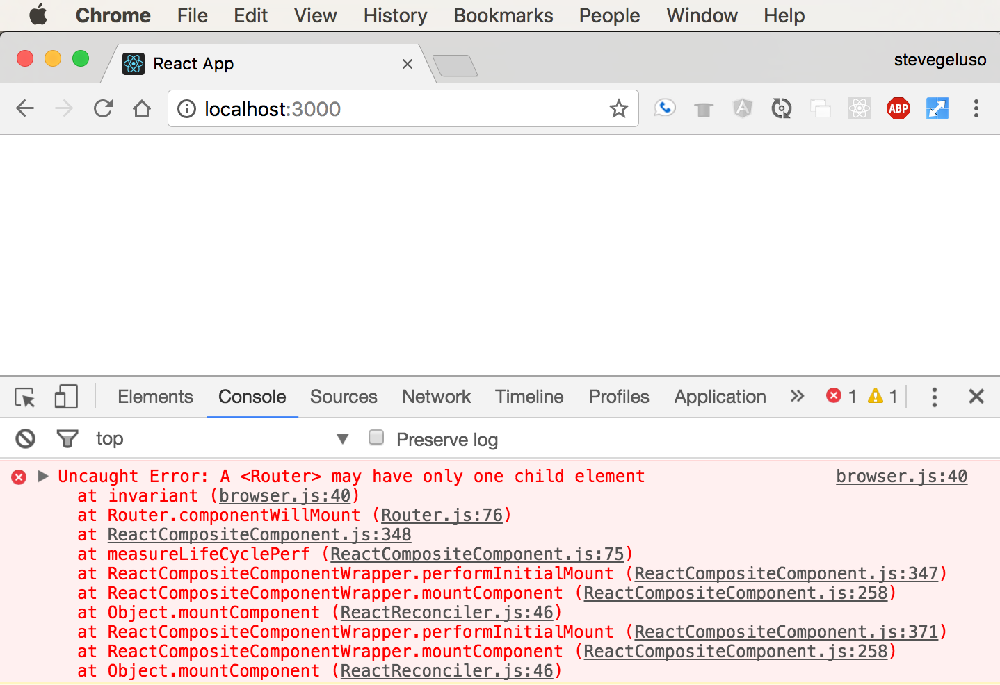

#  Exercise: Build a Dentist Website, Part 2

In this exercise, we'll work on displaying pages individually.


Try this: Delete two of the three components so only one component is left on the page at a time. 

<aside class="notes">

**Talking points**:
* You should see your webpage update with just that component. This is effectively what React Router does. We can configure React Router
so it's aware of which component we want to show on the screen, and React Router will swap out the components so only the correct one is shown at a time.
* Now that we're able to show each of the components on the main page, it's time to hook them up to a Router component.

</aside>

---

## Creating Routes

React Router uses some of its components to define how URLs are routed to your components and create links to those routes. You must have one `<Router>` component that wraps itself around multiple `<Route>` components. Each `<Route>` component has two pieces:
- `path`: defines the URL path that leads to the component.
- `component`: defines what component users will see when they navigate to the path.

Delete what's currently returned in the `render` function of your `App.js` and replace it with a Router component call with three routes, as shown below.

```js
class App extends Component {
  render() {
    return (
      <Router>
        <div>
          <Route exact path="/" component={Home} />
          <Route path="/procedures" component={Procedures} />
          <Route path="/contact" component={Contact} />
        </div>
      </Router>
    )
  }
}
```

<aside class="notes">

**Talking point**:
* This is the general syntax for creating routes.

</aside>

---
Three other important things to note:

* The Router component call goes **in place of** your existing component calls for `<Home />` or `<Home></Home>`.

* The first route for the home page at the root URL path `/` uses an extra `exact` attribute before defining the path.

* Notice that all of the `<Route>` components are wrapped inside one `<div>`. Like `render`, the `<Router>` element can only have one direct child element. If you don't wrap the routes with a `<div>`, the page will appear blank and you'll have to open your JavaScript console to check for any errors logged, like so:




<aside class="notes">

**Talking points**:
* `<Home />` or `<Home></Home>` depends on which syntax you went for.
* The `exact` attribute means the component associated with the route will only be shown if users are exactly at that URL path. If you forget to include the `exact` keyword, users will actually see two components when they navigate to `/contact` because `/` is a partial match for `/contact`.
* If you don't wrap the routes with a `<div>`, the page will appear blank and you'll have to open your JavaScript console to check for any errors.
* Pro tip: It's a good habit to check the console for errors whenever your app is not behaving as expected.

</aside>

---


## Import Statements


```js
import {
  BrowserRouter as Router,
  Route,
  Link
} from 'react-router-dom';
```

<aside class="notes">

**Talking points**:

- To use the React Router components in `App.js`, you'll need to import them. This import syntax allows us to grab several specific components from the `react-router-dom` library at once. So far, we've used `Router` and `Route`.

- While we're here, we'll also import a third component, `Link`, which we'll get to in a bit.

- Put the code seen on this slide at the top of your `App.js`.

- The Router component is called `BrowserRouter` inside the library package, but we'll use the `as` keyword to rename it to
`Router` so it's easier to remember.

</aside>

---

## Fully Routed

**`App.js`**
```js
import React, { Component } from 'react';
import './App.css';

import {
  BrowserRouter as Router,
  Route,
  Link
} from 'react-router-dom';

import Home from './Home';
import Procedures from './Procedures';
import Contact from './Contact';


class App extends Component {
  render() {
    return (
      <Router>
        <div>
          <Route exact path="/" component={Home} />
          <Route path="/procedures" component={Procedures} />
          <Route path="/contact" component={Contact} />
        </div>
      </Router>
    )
  }
}

export default App
```

<aside class="notes">

**Talking point**:

- This is how the imports and components for our dentist website look like altogether.

</aside>

--- 

## Navigate to the Routes
 
If you go to <http://localhost:3000/>, you should see the home page. 

If you go to <http://localhost:3000/procedures>, you should see the procedures page. 

If you go to <http://localhost:3000/contact>, you should see the contact page.


<aside class="notes">

**Talking points**:
* Now that everything is hooked up, you can browse to the different URLs and see how each page appears.
* Check to make sure that:
  * React Router is routing from each URL to the proper component correctly.
  * The home page doesn't display at the same time as another component. If the home page is shown while you're at the path to `/procedures` or `/contact`, you probably didn't write the `exact` keyword when you defined the `/` home route.

**Teaching tip**:
* Give students time to complete their checks.

</aside>

---

## Debugging Common Errors

Let's intentionally make an error. 

 

<aside class="notes">

**Talking points**:

* Delete the `exact` keyword on the home route then navigate to the `/procedures` page and the `/contact` page to see how the components are displayed.

* You should see the content of the home page and the content for one of the other pages at the same time, with the home page on top.

* Now add the `exact` keyword back to the home route and notice that the pages don't double up anymore.

* Two common errors:
    * If the page appears blank, open the JavaScript console to check for errors. Chances are you have a typo somewhere or forgot to make sure `<Router>` only has one child element. Remember, wrap all of your `<Route>` components in one `<div>`.
    
    * If multiple components appear on the page at the same time, there's something wrong with how you've routed URLs. Make sure you use the `exact` keyword on the root path `/` and there are no duplicate URL paths defined anywhere.

</aside>

---

## Adding a Nav Section


`<Link>` creates `<a>` tags and automatically integrates modern HTML5 browser history mechanics for a single-page application. It has one attribute — `to` — which defines what path to navigate to when the user clicks the link.

We'll add a `<Link>` component for each of our content pages.

```html
<Link to="/">Go to Home Page</Link>
<Link to="/procedures">See Our Procedures</Link>
<Link to="/contact">Contact Us</Link>
```

<aside class="notes">

**Talking points**:

* Great, now our site is up and running. We can manually type in URLs and see the different pages. Although users never really type URLs, do they? We should probably have links at the top of the page so users can just click on them. We could build this ourselves, but we don't have to. Remember that `Link` component we imported from React Router? Just like links in HTML, we can wrap `<Link>` tags around whatever text we want the user to click on.
* Did you notice that we don't reference components here? We simply make links for users to click that connect to URLs, and the `Router` section in the code handles the actual component changes.
* We can include those links in a `<nav>` element at the top of our page. It will stay on the page permanently and the different components will be swapped between each other below it. There's actually nothing special about the `<nav>` element. It behaves exactly like a `<div>`. `<nav>` is just a semantic element that gives your JSX more meaning when people read it.


</aside>

---- 

## Rendering a Nav Section

In your `App.js`, inside the `<div>` and before the `Route` statements, put:

```html
<nav>
  <Link to="/">Home</Link>
  <Link to="/procedures">Procedures</Link>
  <Link to="/contact">Contact</Link>
</nav>
```
--- 


So instead of the code we used before, here's how we'll format the links. Nothing has changed except that we've added the space:

```html
<Link to="/">Go to Home Page</Link>{' '}
<Link to="/procedures">See Our Procedures</Link>{' '}
<Link to="/contact">Contact Us</Link>
```

And now the nav bar will have spaces like it should. Try it!


<aside class="notes">

**Talking points**:
* Our web app now looks like the left image. But do you see a difference between the left and right images?
* React strips out whitespace (e.g., spaces, returns, tabs) between elements. If we write `<Link>` components next to each other, even if they're on new lines in our code, React strips all of the whitespace between them and brings them all together.

</aside>

----

We must insert a space manually by writing `{' '}` to get spaces between our links.

<aside class="notes">

**Talking point**:

* We must insert a space manually by writing `{' '}` to get spaces between our links.

</aside>

--- 

## Final Code

Here's what our final `App.js` looks like:

```js
class App extends Component {
  render() {
    return (
      <Router>
        <div>
          <nav>
            <Link to="/">Go to Home Page</Link>{' '}
            <Link to="/procedures">See Our Procedures</Link>{' '}
            <Link to="/contact">Contact Us</Link>
          </nav>
          <Route exact path="/" component={Home} />
          <Route path="/procedures" component={Procedures} />
          <Route path="/contact" component={Contact} />
        </div>
      </Router>
    )
  }
}

export default App
```

<aside class="notes">

**Talking point**: 

* Check it out! Does yours work?

</aside>
