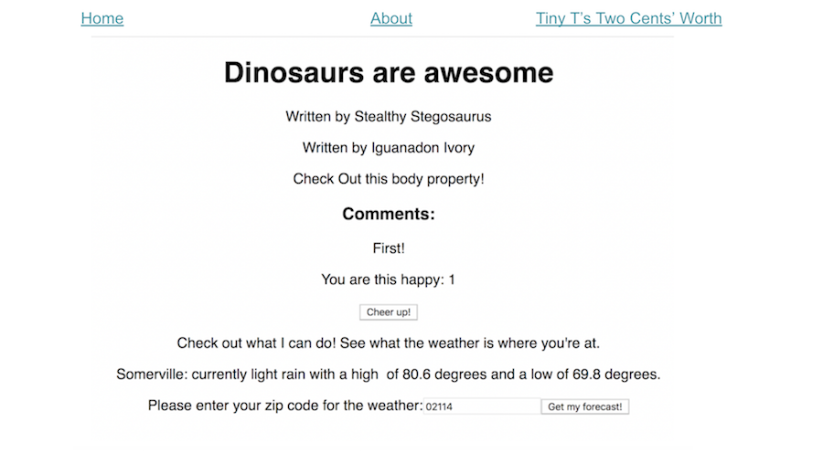

#  React Router: Section Recap and Exercise


## Recap
What have we learned so far?
* Single Page Applications have specific URLs that are routed to display
  different content.
* React Router is a third-party library that we can install and use with React.
* Since React Router isn't built into React, we must import its components.
* React Router makes it easy for us to route URLs to components.
* React Router automatically manipulates modern browser history mechanics.

Now let's put that to the test!

---

## Try It: Implement Router on Your Dinosaur Blog


Task:

- Create two new pages to your blog:
  - An "About" page (bios of the dino authors)
  - A "Tiny T's Two Cents' Worth" page (Tiny's opinions on the saurian political scene)
  - Get creative and add some fun additional content to these other routes.
  
- Create a navigation menu of list items that route to each page.
 
 
  <aside class="notes">

**Talking Points**:

- Each page is a component - we're learning to use React Router here!
  
**Teaching Tip**:

- This exercise requires students to refactor their `App.js` file.

**Hint**: You'll need multiple `.js` files

**Hint**: Do you have `react-router-dom` installed for this project?

**Hint**: You can instantiate a component with `props` inside of a `<Route>` element. An example is below:

</aside>

---

```js
render={(props) => <Dashboard {...props} title={post.title}   author={post.author} body={post.body} comments={post.comments}/>}
```

---

## Solution




<aside class="notes">

**Talking Point**:

Your solution should look something like what is seen here.

</aside>

