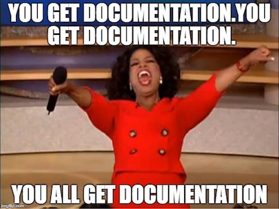
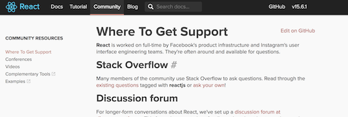

#  Exploring Documentation

## Learning Objectives
After this lesson, you'll be able to:
- Comprehend React documentation.
- Apply concepts in the React documentation.

## Documentation

 
Image source: https://www.scottturman.com/

<aside class="notes">

**Talking points**:

- When you don't know how to do something in programming, a great place to check is the documentation. That's what we'll be doing in this lesson — finding the answers in documentation.

- Some frameworks have documentation that's dense and difficult to parse, but others are much more straightforward. Luckily, React.js is one of the more well-written ones.

- You'll be looking at the React documentation to practice learning on your own. This lesson doesn't have a lot of answers in it because the hope is that you'll be able to find them yourself. We'll be here to point you in the right direction.

</aside>

----

## Looking at the React Website

Because React was created by Facebook, it has a large community with a lot of information.

Open the [React home page](https://facebook.github.io/react/).
 

<aside class="notes">

**Talking point**:

- Click "Tutorial" at the top. This is a tutorial to walk you through learning React. It's the tic-tac-toe game that you'll do later in this unit.

**Teaching tips:**

- Direct students to open the React home page.

- If that last exercise was a little confusing, it might be worth pausing this lesson to run through the tutorial and reinforce what we've learned so far.

</aside>

----

## The React Community

There are many recommended places to ask for help within "Community."

<aside class="notes">

**Talking points**:

- Here are recommended places to ask for help. However, make sure you try your best to find the answer first. Many frameworks don't have such a large community, so being able to find the answer on your own is crucial. Also, while a problem might seem dire, the solution may well be a single command or short explanation found in the documentation.

- That said, looking through questions that have been asked previously is a great place for research. If you're having a problem, chances are high that someone else once had that same problem.

</aside>

----

## The React Documentation

Click on "Docs."

The navigation bar contains:
- Getting started guide.
- Main concepts.
- Advanced guides. 
- API reference.

<aside class="notes">

**Talking points**:

- Let's dive in. Click on "Docs."
- On the right is a navigation bar containing a getting started guide, main concepts, advanced guides, and an API reference (as well as how to contribute, which you could do some day).
- Under "Main Concepts," click on "Rendering Elements." Read through the page, paying attention to the examples. Hopefully, this is all review and relatively straightforward.
- Congratulations! You've read a page of React.js documentation.

</aside>

---- 

## Documentation Exercise: Conditional Rendering

Now let's apply something new.

Step 1: In the search bar at the top, look for "Conditional Rendering" and read through the page. 

Step 2: Referring to the documentation on conditional rendering, finish [this CodePen application](https://codepen.io/SuperTernary/pen/wrooQP) so there's only a single list displayed at any time, with a corresponding button that changes between "Show matching fruits" and "Show unmatching fruits."
  - The two functions creating the buttons have been made for you, below the class declaration.
  - The `return` method in the `render` method is accurate, as well as the `handleFilterChange()` method. No modifications are needed in either `handleFilterChange()` or the `return`.
  

Here are screenshots of the two different states of the app:

When you have it, check your solution against [this CodePen](https://codepen.io/SuperTernary/pen/XeNNEG?editors=0010).

<aside class="notes">

**Talking points**:
- Now let's apply something new. In the search bar at the top, look for "Conditional Rendering."
- Read through the page.
- Then, look at this CodePen application — it's the fruit filter from before. Currently, it only lists the matching fruits. However, it has functions to make the list for unmatching ones.
- Referring to the documentation on conditional rendering, finish this application so there's only a single list displayed at any time, with a corresponding button that changes between "Show matching fruits" and "Show unmatching fruits."
  - The two functions creating the buttons have been made for you, below the class declaration.
  - The `return` method in the `render` method is accurate, as well as the `handleFilterChange()` method. No modifications are needed in either `handleFilterChange()` or the `return`.
  
**Teaching tip**:
- Provide [this CodePen](https://codepen.io/SuperTernary/pen/qPqqQE?editors=0010) for students who need support. There's a comment everywhere they need to make a modification.

  
</aside>
