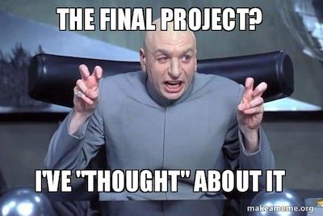

#  Final Project

## Project Overview

It's time to build something you'll be proud to call your own.

This is an open-ended project. There's no set solution that we can provide, but of course we're here to help.

You'll be making your own site. This can be a site that you imagine, but feel free to pick an existing website and try to mimic it. Some websites that use React to model yours after are:
  - https://www.airbnb.com/
  - https://citymapper.com/boston
  - https://reddit.com
  - https://www.instagram.com/
  - https://www.nytimes.com/

Once you have a website with basic functionality that you're satisfied with, look at the "Further Directions" section and choose at least one of the options to implement.

### Requirements

* Utilize both nested components and `state`.
* Use React Router and include a nav bar.
* Use ES6 syntax; don't forget about functional components.

### Suggestions and Hints

- Don't worry about styling at first. Focus on getting the functionality working.
- Remember that `state` and `props` are **not** the same.
  - `state` represents the **state** of your user interface component.
  - `state` can trigger changes in `props`, or `props` can come from parent components.
- Stick to functional programming techniques whenever possible (e.g., use built-in methods such as `.forEach()` and `.map()` if available).
- If you're rendering a list of child components (such as a `ul` -> `li` list), each individual child component needs a unique `key` for React to work with it. This is so React can identify each element uniquely, if necessary.

### Further Directions

Once you have a website with basic functionality that you're satisfied with, choose at least one of the options below to implement.

* **Option 1:** Learn about React styling. Strengthen your knowledge of React by creating a new React application and recreating the UI, or by applying styling to the project you started in the last exercise.
* **Option 2:** Learn about and implement React animations and apply them to the blog or the project you built in the last exercise.
* **Option 3:** In addition to animations, incorporate Flow — a static type checker — into your application.

### Deliverables

When you're satisfied with your web application and have implemented at least one of the further options, host your app on Heroku. Share the link as well as your repository with your instructor.

Enjoy the challenge!

<aside class="notes">

**Talking point**:
- Note: We don't have a database set up, so if you need data, feel free to hard-code a little (just enough to get the idea) or use `fetch` to call an API.

</aside>

## Evaluation

Your project will be evaluated based on the rubric below.

### Rubric

| Score | Expectations |
| ----- | ---------------------------------------------------- |
| 0 | Incomplete |
| 1 | Does not meet expectations |
| 2 | Meets expectations — good job! |
| 3 | Exceeds expectations — fantastic! |

Here's an example of how the criteria works. Let's say your assignment was to cook pizza:

Criteria | **0** (Incomplete) | **1** (Does not meet expectations) | **2** (Meets expectations) | **3** (Exceeds expectations) |
:--- | :--- | :--- | :--- | :---
Crust | No crust present. Submission is just cheese and sauce on a plate. | Pizza has a crust, but it's raw. | Crust is cooked thoroughly.| Crust is golden brown and the perfect thickness.
Cheese | No cheese present. | A small sprinkle of unmelted cheese in the middle of the pie. | Cheese covers the pizza from edge to edge but is not fully melted. | Cheese is delicious, plentiful, and melted to perfection.

