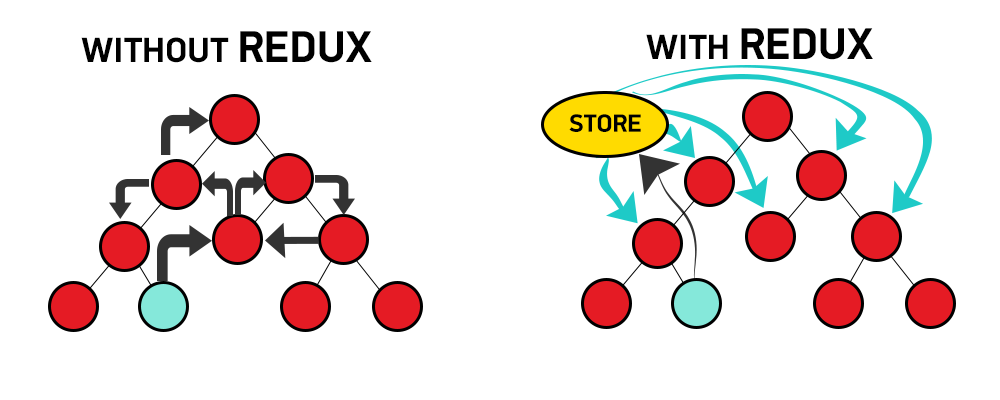
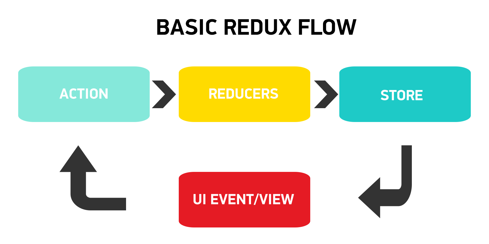

##  {.separator}
<h1>Introduction to Redux</h1>

---

## Learning Objectives

*After this lesson, you will be able to:*

* Define what Redux is and why you would use it
* Explain what actions, reducers and the Redux store is.
* Name benefits of using Redux.

---

## Redux

<aside class="notes">

**Talking Points**:

Redux is a lightweight, predictable state management container for Javascript applications. It was originally inspired by Flux(developed by Facebook). Sometimes you might hear it referred to just as a store. It allows us to write apps that behave consistently and in different environments(client, server and native) while allowing for easy testing.

**Teaching Tips**:

* Fist of five on the knowledge of Redux.
* Have someone read it aloud.
* Ask their ideas about what state management is.
* Ask students to provide an explanation as to why Redux might be helpful.

* If they start asking a lot of questions, this is a simple definition. We're going to break it down shortly.

* Fun fact, by lightweight we mean it's only 2kb so it's not going to weigh your application down.

</aside>

---

## Why use Redux?

As we've learned, React is pretty good at state management without any additional tools. So why Redux too?

*  As your application becomes larger, it becomes increasingly difficult and confusing to manage state across multiple shared components.
*  Keep in mind, components are reusable so you might be using these components across several pages or screens within your app.

Imagine multiple components, that all need to talk to each other, but for different reasons. You might have a hard time understanding where state should live. In a perfect world, component data should be isolated to that particular component. Now consider sibling components and how you would share that data.

As you've learned so far, to share data among siblings, a state has to live in the parent component. The method for updating this state is provided by this parent component and passed as props to these sibling components.

<aside class="notes">

**Talking Points**:

* Relate to your students previous answers on this slide.
* If you have an app you frequently work in Redux, use that as an example and explain why you use it.
* Use specific instances where you have components used in several places. Like, an input box that you might use for a contact page, submission form, email sign up, etc.

</aside>

---

## How it Works

Though it's tricky to grasp at first, Redux is actually pretty simple.

_One central store holds the entire state of the application._ Every component can access state without passing down props from one component to another.

### But, how you ask?!

* **Actions:** Actions are _events_. They are the only way you can send information from your app to your Redux Store. This data sent is typically based on UI events, API calls, and/or event handlers.

* **Reducers:** Reducers are _pure functions_ that take the current state of an app, complete an action and then return a new state.

* **Store:** The store simply _stores the application state_.

<aside class="notes">

**Talking Points**:

* Fist of 5 on actions, reducers, and store.
* If you have a whiteboard app, or whiteboard near, draw out and talk through this transaction.
* Ask an individual how they think this system would benefit a complicated application (spoiler alert, it's the next slide!)

</aside>

---

## Key Redux Benefits

* **Redux provides predictable state**

* **Helps keep code clean and maintainable**

* **Provides easy troubleshooting and debugging**

* **It's easy to test!**

* **Redux has a large supporting community**

* Additionally Redux can persist the app's state to local storage, or even restore it after a refresh.

* It can be used for server-side rendering.

<aside class="notes">

**Talking Points**:

Keep in mind these are longer talking points to expand on the above benefits. Be sure to read these and fully understand them before class.

* In Redux, the state is always predictable. If the same state and action are passed to a reducer, the same result is always produced as reducers are pure functions. The state is also immutable and is never changed. This makes it possible to implement arduous tasks like infinite undo and redo. It is also possible to implement time travel that is, the ability to move back and forth among the previous states and view the results in real-time.

* Redux is strict about how code should be organized so it makes it easier for someone with knowledge of Redux to understand the structure of any Redux application. This generally makes it easier to maintain.

* Redux makes it easy to debug an application. By logging actions and state, it is easy to understand coding errors, network errors and other forms of bugs that might come up during production.

* It is easy to test Redux apps as functions used to change the state of pure functions.

* With it, you can handle the initial render of the app by sending the state of an app to the server along with its response to the server request. The required components are then rendered in HTML and sent to the clients.

* Ask an individual why it would be helpful to manipulate local storage.

Next you'll be implementing Redux in a code along. This will help students further grasp the Redux concepts.

</aside>

---
