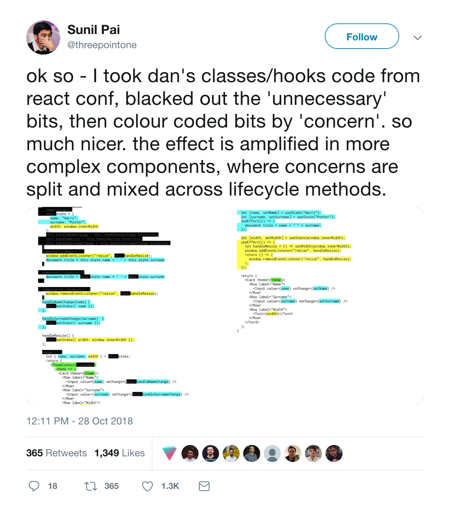
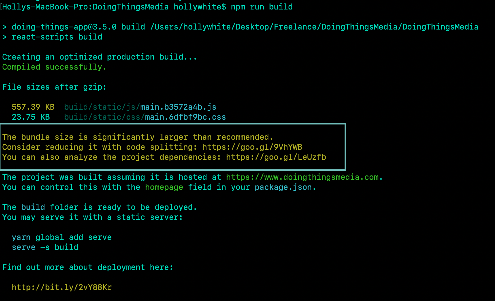

##  {.separator}
<h1>Introduction to React Hooks</h1>

---

## Learning Objectives

*After this lesson, you will be able to:*

* Define React Hooks and why they were introduced
* Explain different use cases for Redux and React Hooks

---

## Intro to React Hooks

If you're keeping up with React, you've probably noticed that React Hooks are brand new and all the rage.

Hooks has been introduced to address a primary complaint of React developers - separation of concern.

Model - Data
View - What the User Sees
Controller - Responds to an event

React, on it's own, does not have an answer for this. Redux, Flux, MobX all currently address these concerns.

Meaning that we often struggle with breaking down complex components because the logic is stateful and can’t be extracted to a function or another component.

Historically when trying to solve this difficult issues we end up with components that are far to large, duplicated logic, or complex patterns like higher ordered components.

<aside class="notes">

**Talking Points**:

* Ask the class who has heard of Hooks? Is there any excitement?
* Have someone read the introduction aloud.

</aside>

---

## What is a Hook?!

<aside class="notes">

**Talking Points**:

</aside>
---

## Problems That Hooks Solve

* **Logic Organization** - Hooks allow us to organize logic inside of a component into reusable, isolated units.

The Twitter post/visual shows a component where unnecessary bits are blacked out and concerns are color coded.

* **Reduces Concepts** - Hooks could make your life in React more simple. In React, we often juggle between ideas and concepts. Hooks let you use functions instead of having to switch between functions, classes, higher-order components, and render props.

* **Potential Bundle Reduction** - As a React developer with growing complex applications, managing your bundle size will become a constant battle. Below is an example of the warning thrown when running `npm run build` on an application that bundles over 500kb.

Hooks tend to minify better than equal code using classes.

* **Hooks are Easy to Implement into Existing React Applications** - Hooks do not require any large rewrites. You can even begin to adopt Hooks in your newly written components.

<aside class="notes">

**Talking Points**:

  * If the screenshot is hard to see, here's a direct [link](https://twitter.com/threepointone/status/1056594421079261185/photo/1) to the Twitter visual.
* https://twitter.com/prchdk/status/1056960391543062528
* Have someone read the introduction aloud.

</aside>

---

Hooks are not yet meant to replace Redux, Flux, MobX or any state management alternative.
